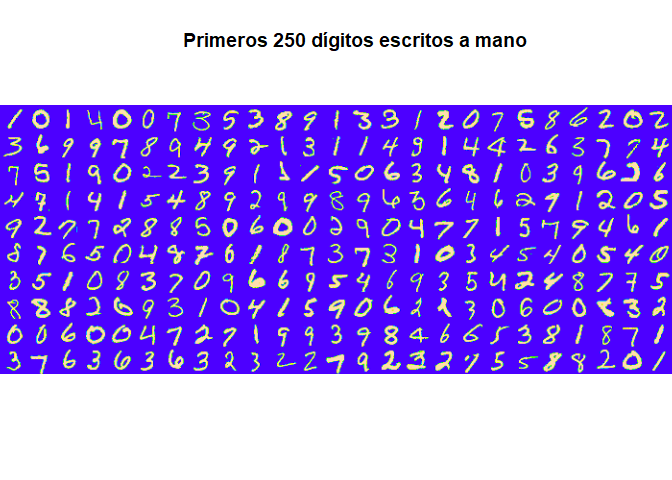
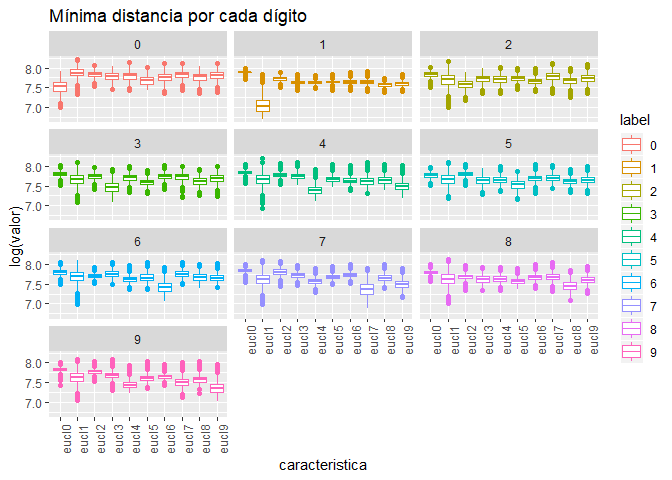

```r
suppressMessages(library(EBImage))
suppressMessages(library(rgl))
suppressMessages(library(caret))
suppressMessages(library(dplyr))
suppressMessages(library(tidyr))
suppressMessages(library(kknn))
suppressMessages(library(randomForest))
suppressMessages(library(ggplot2))
```

# Resumen

MNIST ("Instituto Nacional Modificado de Estándares y Tecnología") es el conjunto de datos de facto de "visión mundial" de la visión de computadora. Desde su lanzamiento en 1999, este clásico conjunto de datos de imágenes manuscritas ha servido como base para los algoritmos de clasificación de referencia. A medida que surgen nuevas técnicas de aprendizaje automático, MNIST sigue siendo un recurso confiable para investigadores y estudiantes por igual.


El conjunto de datos mixto de Instituto Nacional de estándares y tecnología (MNIST) es una colección de 70.000 pequeñas imágenes de dígitos escritos a mano. Los datos fue creados para actuar como un referente para los algoritmos de reconocimiento de imagen. Aunque MNIST las imágenes son pequeñas (28 x 28 pixeles) y sólo hay 10 dígitos posibles (cero a nueve) a reconocer y hay 42.0000 imágenes de formación para la creación de un modelo de reconocimiento de imagen (con 28.000 imágenes tendidas a probar la exactitud de un modelo), la experiencia ha demostrado que reconocer las imágenes MNIST es un problema difícil.

Para lidiar con este problema vamos a extraer características de cada imagen y disminuir el tamaño de cada muestra. Con esto probaremos el desempeño de clasificadores.

# Extraccion de características

Al revisar los datos tenemos un archivo con 42000 imágenes con 785 variables (28x28 píxeles) cada una, esto resulta en 33 millones de datos aproximadamente. Donde la primera columna es el número en la imagen y las 784 restantes corresponden a la imagen del número, como se puede er en la imagen siguiente (primeros 250 dígitos).


```r
# lee archivo con datos de entrenamiento (imagenes de 28x28)
train <- read.csv("train.csv")
train$label <- factor(train$label)
train[,c(2:785)] <- round(train[,c(2:785)], digits = 0)

dim(train)
```

```
[1] 42000   785
```

```r
str(train[,1:10])
```

```
'data.frame':	42000 obs. of  10 variables:
 $ label : Factor w/ 10 levels "0","1","2","3",..: 2 1 2 5 1 1 8 4 6 4 ...
 $ pixel0: num  0 0 0 0 0 0 0 0 0 0 ...
 $ pixel1: num  0 0 0 0 0 0 0 0 0 0 ...
 $ pixel2: num  0 0 0 0 0 0 0 0 0 0 ...
 $ pixel3: num  0 0 0 0 0 0 0 0 0 0 ...
 $ pixel4: num  0 0 0 0 0 0 0 0 0 0 ...
 $ pixel5: num  0 0 0 0 0 0 0 0 0 0 ...
 $ pixel6: num  0 0 0 0 0 0 0 0 0 0 ...
 $ pixel7: num  0 0 0 0 0 0 0 0 0 0 ...
 $ pixel8: num  0 0 0 0 0 0 0 0 0 0 ...
```

```r
l <- 1
for (i in 1:10) {
      for (k in 1:25) {
            if(k==1){
                  b <- matrix(unlist(train[l,-1])/255, ncol = 28, nrow = 28)
            }
            if(k>1){
                  a <- matrix(unlist(train[l,-1])/255, ncol = 28, nrow = 28)
                  b <- rbind(b,a) 
            }
            l <- l+1
      }
      if(i==1){
            c <- b
            remove(b)
      }
      if(i>1){
            c <- cbind(c,b)
            remove(b)
      }
}

display(colormap(c, palette = topo.colors(256)), method = "raster")
title("Primeros 250 dígitos escritos a mano")
```

<!-- -->

Para disminuir la gran cantidad de datos es necesario realizar algunas transformaciones y extraer información resumida de la imagen. En este caso consideraremos los siguientes pasos:

- **Reagrupar píxeles**: Se ordenarán los píxeles en matrices de 28 x 28.
- **Extraer referencia**: Se considera utilizar como referecia al promedio de imagenes de cada clase.
      
      > $I_{ref}^c(i=1:28,j=1:28) = \frac{1}{n} \sum_{k=1}^{n} Im^c(i=1:28,j=1:28,k)$
      
- **Distancia**: Se calcula la distancia euclidiana de cada imagen por cada referencia de clase
      
      > $D^c =  \sqrt{\sum_{i=1}^{28} \sum_{j=1}^{28} (I_{ref}^c(i,j) - Im(i,j))^2}$

El superindice $^c$ representa una imagen o medida asociada a la clase c.

Con esto podemos reducir el número de dimensiones de 785 a 11, que representa alrededor de un 1.4% de los datos originales.

A continuación podemos observar la estructura de cada característica para cada clase, observando distribuciones ligeramente diferentes en cada caso, esto nos servirá a la hora de clasificar cada clase.


```r
# Creacion de conjunto de entrenamiento y pruebas
set.seed(28916022)
Index1 <- createDataPartition(y = train$label, p = 0.7, list = FALSE)
t <- train[Index1,]

# promedio de las imagenes
t0 <- t[1:10,]
for (i in 0:9) {
      t0[i+1,1] <- i
      t0[i+1,-1] <- colMeans(t[t$label==i,-1])
      t0[i+1,-1] <- t0[i+1,-1]*255/max(t0[i+1,-1])
}

t1 <- data.frame()
for (i in 1:dim(train)[1]) {
      t1[i,1] <- train[i,1]
      # distancia euclidea
      for (j in 0:9) {
            t1[i,j+2] <- dist(rbind(t0[j+1,-1], train[i,-1]), method = "euclidean")
      }
}
colnames(t1) <- c("label", "eucl0", "eucl1", "eucl2", "eucl3", "eucl4", "eucl5",
                  "eucl6", "eucl7", "eucl8", "eucl9")
saveRDS(t1,"caract_2_data.rds")
saveRDS(t0,"caract_2_means.rds")
```


```r
t1 <- readRDS("caract_2_data.rds")
t1$label <- factor(t1$label)
str(t1)
```

```
'data.frame':	42000 obs. of  11 variables:
 $ label: Factor w/ 10 levels "0","1","2","3",..: 2 1 2 5 1 1 8 4 6 4 ...
 $ eucl0: num  2697 1700 2635 2564 1792 ...
 $ eucl1: num  1503 3029 1068 2020 3285 ...
 $ eucl2: num  2273 2438 2358 2422 2663 ...
 $ eucl3: num  2149 2481 2104 2428 2694 ...
 $ eucl4: num  2140 2777 2047 1896 3028 ...
 $ eucl5: num  2180 2506 2058 2359 2703 ...
 $ eucl6: num  2325 2590 2003 2080 2944 ...
 $ eucl7: num  2365 2738 1989 2147 2994 ...
 $ eucl8: num  1952 2562 1988 2356 2811 ...
 $ eucl9: num  2238 2785 1975 2104 3020 ...
```

```r
t2 <- gather(t1, key = caracteristica, value = valor, eucl0:eucl9, factor_key = TRUE)

ggplot(data=t2, aes(caracteristica, log(valor),color=label)) +
      geom_boxplot() + facet_wrap(label~., ncol = 3) + ggtitle("Mínima distancia por cada dígito") +
      theme(axis.text.x = element_text(angle = 90, hjust = 1)) 
```

<!-- -->


# Modelo

Antes demodelar debemos dividir los datos reducidos en conjunto de entrenamiento y prueba, con 70% y 30% del total respectivamente.

Con el conjunto de entrenamiento modelaremos 2 clasificadores:

- **LogitBoost**, Este es un algoritmo basado en arboldes de decisión. Para mayor información revisar:

      https://www.rdocumentation.org/packages/caTools/versions/1.17.1/topics/LogitBoost

- **KNN**, Este algoritmo realiza la clasificación de k-nearest neighbor de un conjunto de prueba utilizando un conjunto de entrenamiento. Para cada fila del conjunto de pruebas, se encuentran los k vectores de conjunto de entrenamiento más cercanos (según la distancia de Minkowski), y la clasificación se realiza a través del máximo de densidades del núcleo sumadas. Además se pueden predecir incluso variables ordinales y continuas. Para mayor información revisar:

      https://www.rdocumentation.org/packages/kknn/versions/1.3.1/topics/kknn


En ambos casos consideraremos para entrenamiento validación cruzada con 5 folds.

El resultado del entrenamiento se muestra a continuación.


```r
# crea conjunto entrenamiento 70%-30%
# El indice Index1 se creó más arriba
TEST <- t1[-Index1,]
TRAIN <- t1[Index1,]
# Genera modelos
trC=trainControl(method="cv", number=5)
m="Accuracy"
# KNN
set.seed(2891)
KNNGrid <-  expand.grid(kmax = 9, distance = 1, kernel = "epanechnikov")
fitKNN <- train(label~., data=TRAIN, method="kknn", metric=m,
                trControl=trC, tuneGrid = KNNGrid)

PredKNNtrain<-predict(fitKNN, newdata=TRAIN)
PredKNNtest<-predict(fitKNN, newdata=TEST)
CM_Train_KNN <- confusionMatrix(PredKNNtrain, TRAIN$label)
CM_Test_KNN <- confusionMatrix(PredKNNtest, TEST$label)
saveRDS(fitKNN, "fitKNN2.rds")
saveRDS(CM_Train_KNN, "CM_Train_KNN2.rds")
saveRDS(CM_Test_KNN, "CM_Test_KNN2.rds")
# LogitBoost
fitLGB <- train(label~., data=TRAIN, method="LogitBoost", metric=m, trControl=trC)
PredLGBtrain<-predict(fitLGB, newdata=TRAIN)
PredLGBtest<-predict(fitLGB, newdata=TEST)
CM_Train_LGB <- confusionMatrix(PredLGBtrain, TRAIN$label)
CM_Test_LGB <- confusionMatrix(PredLGBtest, TEST$label)
saveRDS(fitLGB, "fitLGB2.rds")
saveRDS(CM_Train_LGB, "CM_Train_LGB2.rds")
saveRDS(CM_Test_LGB, "CM_Test_LGB2.rds")
```


```r
fitKNN <- readRDS("fitKNN2.rds")
fitLGB <- readRDS("fitLGB2.rds")

fitKNN
```

```
k-Nearest Neighbors 

29404 samples
   10 predictor
   10 classes: '0', '1', '2', '3', '4', '5', '6', '7', '8', '9' 

No pre-processing
Resampling: Cross-Validated (5 fold) 
Summary of sample sizes: 23523, 23525, 23523, 23524, 23521 
Resampling results:

  Accuracy   Kappa    
  0.8958303  0.8842247

Tuning parameter 'kmax' was held constant at a value of 9
Tuning
 parameter 'distance' was held constant at a value of 1
Tuning
 parameter 'kernel' was held constant at a value of epanechnikov
```

```r
fitLGB
```

```
Boosted Logistic Regression 

29404 samples
   10 predictor
   10 classes: '0', '1', '2', '3', '4', '5', '6', '7', '8', '9' 

No pre-processing
Resampling: Cross-Validated (5 fold) 
Summary of sample sizes: 23522, 23522, 23522, 23527, 23523 
Resampling results across tuning parameters:

  nIter  Accuracy   Kappa    
  11     0.8714653  0.8568184
  21     0.8774171  0.8635808
  31     0.8774922  0.8636688

Accuracy was used to select the optimal model using the largest value.
The final value used for the model was nIter = 31.
```


# Pruebas

Ambos clasificadores presentan un buen desempeño para clasificar digitos. Ahora se muestra el resultado de las pruebas con el 30% de datos asignado al conjunto de pruebas.


```r
CM_Test_KNN <- readRDS("CM_Test_KNN2.rds")
CM_Test_LGB <- readRDS("CM_Test_LGB2.rds")

CM_Test_KNN
```

```
Confusion Matrix and Statistics

          Reference
Prediction    0    1    2    3    4    5    6    7    8    9
         0 1186    0   12    7    1   16   17    1    5    5
         1    1 1369    2    7    1    5    3   18   21    4
         2   12    5 1136   45    4    7    8    7   12    4
         3    4    7   24 1059    1   56    2    3   40   17
         4    2    0   13    1 1086    5    6    7   11   98
         5    9    6    7   82    7  987   14    3   53   12
         6   13    6   20    6   20   20 1186    0   13    4
         7    0    1   16   16    7    1    0 1224    7   38
         8    9    3   15   66   11   36    3    6 1027   21
         9    3    8    8   16   83    5    2   51   29 1053

Overall Statistics
                                          
               Accuracy : 0.8981          
                 95% CI : (0.8927, 0.9034)
    No Information Rate : 0.1115          
    P-Value [Acc > NIR] : < 2.2e-16       
                                          
                  Kappa : 0.8868          
 Mcnemar's Test P-Value : NA              

Statistics by Class:

                     Class: 0 Class: 1 Class: 2 Class: 3 Class: 4 Class: 5
Sensitivity           0.95722   0.9744  0.90662  0.81149  0.88943  0.86731
Specificity           0.99436   0.9945  0.99083  0.98636  0.98743  0.98316
Pos Pred Value        0.94880   0.9567  0.91613  0.87304  0.88365  0.83644
Neg Pred Value        0.99533   0.9968  0.98970  0.97839  0.98812  0.98677
Prevalence            0.09836   0.1115  0.09948  0.10360  0.09694  0.09035
Detection Rate        0.09416   0.1087  0.09019  0.08407  0.08622  0.07836
Detection Prevalence  0.09924   0.1136  0.09844  0.09630  0.09757  0.09368
Balanced Accuracy     0.97579   0.9844  0.94873  0.89893  0.93843  0.92523
                     Class: 6 Class: 7 Class: 8 Class: 9
Sensitivity           0.95568  0.92727  0.84319  0.83838
Specificity           0.99102  0.99237  0.98506  0.98192
Pos Pred Value        0.92081  0.93435  0.85798  0.83704
Neg Pred Value        0.99514  0.99149  0.98324  0.98210
Prevalence            0.09852  0.10480  0.09670  0.09971
Detection Rate        0.09416  0.09717  0.08153  0.08360
Detection Prevalence  0.10225  0.10400  0.09503  0.09987
Balanced Accuracy     0.97335  0.95982  0.91412  0.91015
```

```r
CM_Test_LGB
```

```
Confusion Matrix and Statistics

          Reference
Prediction    0    1    2    3    4    5    6    7    8    9
         0 1096    0   17   12    1   14   14    4    6    9
         1    0 1299   11    8    2   10   11   18   13    5
         2    7   21  927   57    7   17   13   11   27    2
         3    4    4   23  893    3   72    0    3   63   24
         4    1    2   11    3  941   19   13    4    8   85
         5   10   15    4   64    5  748   27    6   48    9
         6   17    5   36    2   24   20 1055    0    6    2
         7    0    2   21   13    4    8    0 1121    5   74
         8   11    1   17   32    9   11    4    3  805   15
         9    6    3   10   21   62    6    5   46   34  800

Overall Statistics
                                          
               Accuracy : 0.8751          
                 95% CI : (0.8688, 0.8812)
    No Information Rate : 0.1222          
    P-Value [Acc > NIR] : < 2.2e-16       
                                          
                  Kappa : 0.8611          
 Mcnemar's Test P-Value : NA              

Statistics by Class:

                     Class: 0 Class: 1 Class: 2 Class: 3 Class: 4 Class: 5
Sensitivity           0.95139   0.9608  0.86072  0.80814  0.88941  0.80865
Specificity           0.99223   0.9920  0.98378  0.98033  0.98541  0.98146
Pos Pred Value        0.93436   0.9434  0.85124  0.82002  0.86569  0.79915
Neg Pred Value        0.99434   0.9945  0.98497  0.97875  0.98828  0.98253
Prevalence            0.10409   0.1222  0.09732  0.09985  0.09560  0.08358
Detection Rate        0.09903   0.1174  0.08376  0.08069  0.08503  0.06759
Detection Prevalence  0.10599   0.1244  0.09840  0.09840  0.09822  0.08458
Balanced Accuracy     0.97181   0.9764  0.92225  0.89424  0.93741  0.89506
                     Class: 6 Class: 7 Class: 8 Class: 9
Sensitivity           0.92382   0.9219  0.79310  0.78049
Specificity           0.98872   0.9871  0.98975  0.98078
Pos Pred Value        0.90403   0.8982  0.88656  0.80564
Neg Pred Value        0.99121   0.9903  0.97933  0.97767
Prevalence            0.10319   0.1099  0.09171  0.09262
Detection Rate        0.09533   0.1013  0.07274  0.07229
Detection Prevalence  0.10545   0.1128  0.08205  0.08973
Balanced Accuracy     0.95627   0.9545  0.89143  0.88063
```

El resultado es similar al entrenamiento, por lo que ambos clasificadores funcionan bien y no están sobre entrenados.

---

# Conclusiones

Ambos clasificadores presentan un buen desempeño superior al 87%.

La reduccion de dimensiones permitió reducir el tiempo de ejecución en mi computador de manera considerable. Esto es importante, ya que si consideramos un problema similar con imagenes más grandes la cantidad de dimensiones seguiría igual, ya que depende de las clases.

Este es un buen desempeño considerando la información pérdida. Este parece ser un buen enfoque entre rendimiento vs complejidad. Aunque es posible de mejorar.

---

# Referencia

Para revisar el código de este trabajo ir a:

https://github.com/desareca/Procesamiento-Imagenes-R

---

# Información de sesión


```r
sessionInfo()
```

```
R version 3.5.2 (2018-12-20)
Platform: x86_64-w64-mingw32/x64 (64-bit)
Running under: Windows 10 x64 (build 17134)

Matrix products: default

locale:
[1] LC_COLLATE=Spanish_Chile.1252  LC_CTYPE=Spanish_Chile.1252   
[3] LC_MONETARY=Spanish_Chile.1252 LC_NUMERIC=C                  
[5] LC_TIME=Spanish_Chile.1252    

attached base packages:
[1] stats     graphics  grDevices utils     datasets  methods   base     

other attached packages:
[1] randomForest_4.6-14 kknn_1.3.1          tidyr_0.8.3        
[4] dplyr_0.8.0.1       caret_6.0-81        ggplot2_3.1.0      
[7] lattice_0.20-38     rgl_0.99.16         EBImage_4.24.0     

loaded via a namespace (and not attached):
 [1] jsonlite_1.6            splines_3.5.2          
 [3] foreach_1.4.4           prodlim_2018.04.18     
 [5] shiny_1.2.0             assertthat_0.2.0       
 [7] stats4_3.5.2            tiff_0.1-5             
 [9] yaml_2.2.0              ipred_0.9-8            
[11] pillar_1.3.1            glue_1.3.0             
[13] digest_0.6.18           manipulateWidget_0.10.0
[15] promises_1.0.1          colorspace_1.4-0       
[17] recipes_0.1.4           htmltools_0.3.6        
[19] httpuv_1.4.5.1          Matrix_1.2-15          
[21] plyr_1.8.4              timeDate_3043.102      
[23] pkgconfig_2.0.2         purrr_0.3.1            
[25] xtable_1.8-3            fftwtools_0.9-8        
[27] scales_1.0.0            webshot_0.5.1          
[29] jpeg_0.1-8              later_0.8.0            
[31] gower_0.1.2             lava_1.6.5             
[33] tibble_2.0.1            generics_0.0.2         
[35] withr_2.1.2             nnet_7.3-12            
[37] BiocGenerics_0.28.0     lazyeval_0.2.1         
[39] survival_2.43-3         magrittr_1.5           
[41] crayon_1.3.4            mime_0.6               
[43] evaluate_0.13           nlme_3.1-137           
[45] MASS_7.3-51.1           class_7.3-14           
[47] tools_3.5.2             data.table_1.12.0      
[49] stringr_1.4.0           munsell_0.5.0          
[51] locfit_1.5-9.1          compiler_3.5.2         
[53] rlang_0.3.1             grid_3.5.2             
[55] RCurl_1.95-4.11         iterators_1.0.10       
[57] htmlwidgets_1.3         igraph_1.2.4           
[59] crosstalk_1.0.0         miniUI_0.1.1.1         
[61] bitops_1.0-6            rmarkdown_1.11         
[63] gtable_0.2.0            ModelMetrics_1.2.2     
[65] codetools_0.2-15        abind_1.4-5            
[67] reshape2_1.4.3          R6_2.4.0               
[69] lubridate_1.7.4         knitr_1.21             
[71] stringi_1.3.1           parallel_3.5.2         
[73] Rcpp_1.0.0              rpart_4.1-13           
[75] png_0.1-7               tidyselect_0.2.5       
[77] xfun_0.5               
```


