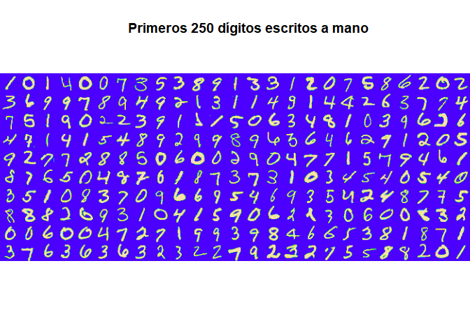
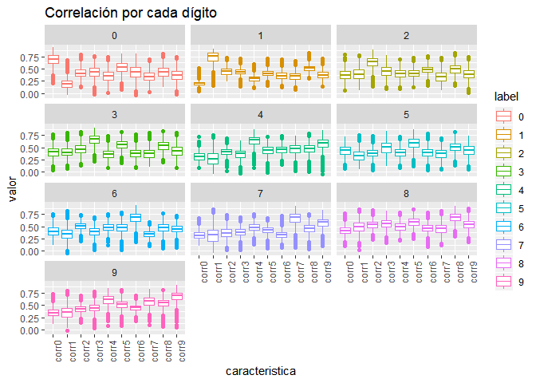

```r
timeProc <- proc.time()
suppressMessages(library(EBImage))
suppressMessages(library(rgl))
suppressMessages(library(caret))
suppressMessages(library(dplyr))
suppressMessages(library(tidyr))
suppressMessages(library(kknn))
suppressMessages(library(randomForest))
suppressMessages(library(ggplot2))
```

# Resumen

MNIST ("Instituto Nacional Modificado de Estándares y Tecnología") es el conjunto de datos de facto de "visión mundial" de la visión de computadora. Desde su lanzamiento en 1999, este clásico conjunto de datos de imágenes manuscritas ha servido como base para los algoritmos de clasificación de referencia. A medida que surgen nuevas técnicas de aprendizaje automático, MNIST sigue siendo un recurso confiable para investigadores y estudiantes por igual.


El conjunto de datos mixto de Instituto Nacional de estándares y tecnología (MNIST) es una colección de 70.000 pequeñas imágenes de dígitos escritos a mano. Los datos fue creados para actuar como un referente para los algoritmos de reconocimiento de imagen. Aunque MNIST las imágenes son pequeñas (28 x 28 pixeles) y sólo hay 10 dígitos posibles (cero a nueve) a reconocer y hay 42.0000 imágenes de formación para la creación de un modelo de reconocimiento de imagen (con 28.000 imágenes tendidas a probar la exactitud de un modelo), la experiencia ha demostrado que reconocer las imágenes MNIST es un problema difícil.

Para lidiar con este problema vamos a extraer características de cada imagen y disminuir el tamaño de cada muestra. Con esto probaremos el desempeño de clasificadores.

# Extraccion de características

Al revisar los datos tenemos un archivo con 42000 imágenes con 785 variables (28x28 píxeles) cada una, esto resulta en 33 millones de datos aproximadamente. Donde la primera columna es el número en la imagen y las 784 restantes corresponden a la imagen del número, como se puede er en la imagen siguiente (primeros 250 dígitos).


```r
# lee archivo con datos de entrenamiento (imagenes de 28x28)
train <- read.csv("train.csv")
train$label <- factor(train$label)
# train[,c(2:785)] <- round(train[,c(2:785)], digits = 0)

dim(train)
```

```
[1] 42000   785
```

```r
str(train[,1:10])
```

```
'data.frame':	42000 obs. of  10 variables:
 $ label : Factor w/ 10 levels "0","1","2","3",..: 2 1 2 5 1 1 8 4 6 4 ...
 $ pixel0: int  0 0 0 0 0 0 0 0 0 0 ...
 $ pixel1: int  0 0 0 0 0 0 0 0 0 0 ...
 $ pixel2: int  0 0 0 0 0 0 0 0 0 0 ...
 $ pixel3: int  0 0 0 0 0 0 0 0 0 0 ...
 $ pixel4: int  0 0 0 0 0 0 0 0 0 0 ...
 $ pixel5: int  0 0 0 0 0 0 0 0 0 0 ...
 $ pixel6: int  0 0 0 0 0 0 0 0 0 0 ...
 $ pixel7: int  0 0 0 0 0 0 0 0 0 0 ...
 $ pixel8: int  0 0 0 0 0 0 0 0 0 0 ...
```

```r
l <- 1
for (i in 1:10) {
      for (k in 1:25) {
            if(k==1){
                  b <- matrix(unlist(train[l,-1])/255, ncol = 28, nrow = 28)
            }
            if(k>1){
                  a <- matrix(unlist(train[l,-1])/255, ncol = 28, nrow = 28)
                  b <- rbind(b,a) 
            }
            l <- l+1
      }
      if(i==1){
            c <- b
            remove(b)
      }
      if(i>1){
            c <- cbind(c,b)
            remove(b)
      }
}

display(colormap(c, palette = topo.colors(256)), method = "raster")
title("Primeros 250 dígitos escritos a mano")
```

<!-- -->

Para disminuir la gran cantidad de datos es necesario realizar algunas transformaciones y extraer información resumida de la imagen. En este caso consideraremos los siguientes pasos:

- **Reagrupar píxeles**: Se ordenarán los píxeles en matrices de 28 x 28.
- **Extraer referencia**: Se considera utilizar como referecia al promedio de imagenes de cada clase.
      
      > $I_{ref}^c(i,j) = \frac{1}{n} \sum_{k=1}^{n} Im^c(i,j,k)$
      
- **Correlación**: Se calcula la correlación de "Pearson" de cada imagen por cada referencia de clase
      
      > $C^c =  \frac{\sum_{k=1}^{n} (Im(i,j,k) - \overline{Im(i,j,k)})(I_{ref}^c(i,j) - \overline{I_{ref}^c(i,j)})}{\sqrt{\sum_{k=1}^{n} (Im(i,j,k) - \overline{Im(i,j,k)})^2}\sqrt{\sum_{k=1}^{n} (I_{ref}^c(i,j) - \overline{I_{ref}^c(i,j)})^2}}$

El superindice $^c$ representa una imagen o medida asociada a la clase $c$, y el $\overline{x}$ representa el promedio de $x$.

Con esto podemos reducir el número de dimensiones de 785 a 11, que representa alrededor de un 1.4% de los datos originales.

A continuación podemos observar la estructura de cada característica para cada clase, observando distribuciones ligeramente diferentes en cada caso, esto nos servirá a la hora de clasificar cada clase.


```r
# Creacion de conjunto de entrenamiento y pruebas
set.seed(28916022)
Index1 <- createDataPartition(y = train$label, p = 0.7, list = FALSE)
t <- train[Index1,]

# promedio de las imagenes
t0 <- t[1:10,]
for (i in 0:9) {
      t0[i+1,1] <- i
      t0[i+1,-1] <- as.numeric(colMeans(t[t$label==i,-1]))
      t0[i+1,-1] <- t0[i+1,-1]*255/max(t0[i+1,-1])
}

t1 <- data.frame()
for (i in 1:dim(train)[1]) {
      t1[i,1] <- train[i,1]
      a <- data.frame(as.numeric(train[i,-1]), stringsAsFactors = FALSE)
      # correlacion
      for (j in 0:9) {
            # t1[i,j+2] <- dist(rbind(t0[j+1,-1], train[i,-1]), method = "euclidean")
            t1[i,j+2] <- cor(t(t0[j+1,-1]), a)
      }
}
colnames(t1) <- c("label", "corr0", "corr1", "corr2", "corr3", "corr4", "corr5",
                  "corr6", "corr7", "corr8", "corr9")
saveRDS(t1,"caract_3_data.rds")
saveRDS(t0,"caract_3_means.rds")
```


```r
t1 <- readRDS("caract_3_data.rds")
t1$label <- factor(t1$label)
str(t1)
```

```
'data.frame':	42000 obs. of  11 variables:
 $ label: Factor w/ 10 levels "0","1","2","3",..: 2 1 2 5 1 1 8 4 6 4 ...
 $ corr0: num [1:42000, 1:11] 0.192 0.791 0.219 0.237 0.801 ...
 $ corr1: num [1:42000, 1:11] 0.5756 0.1792 0.7703 0.0566 0.1461 ...
 $ corr2: num [1:42000, 1:11] 0.455 0.531 0.401 0.327 0.489 ...
 $ corr3: num [1:42000, 1:11] 0.41 0.5 0.425 0.161 0.472 ...
 $ corr4: num [1:42000, 1:11] 0.26 0.326 0.285 0.363 0.284 ...
 $ corr5: num [1:42000, 1:11] 0.364 0.477 0.429 0.173 0.456 ...
 $ corr6: num [1:42000, 1:11] 0.226 0.441 0.42 0.337 0.341 ...
 $ corr7: num [1:42000, 1:11] 0.174 0.373 0.4 0.26 0.327 ...
 $ corr8: num [1:42000, 1:11] 0.511 0.456 0.481 0.19 0.41 ...
 $ corr9: num [1:42000, 1:11] 0.247 0.339 0.395 0.273 0.304 ...
```

```r
t2 <- gather(t1, key = caracteristica, value = valor, corr0:corr9, factor_key = TRUE)

ggplot(data=t2, aes(caracteristica, valor,color=label)) +
      geom_boxplot() + facet_wrap(label~., ncol = 3) + ggtitle("Correlación por cada dígito") +
      theme(axis.text.x = element_text(angle = 90, hjust = 1)) 
```

<!-- -->


# Modelo

Antes demodelar debemos dividir los datos reducidos en conjunto de entrenamiento y prueba, con 70% y 30% del total respectivamente.

Con el conjunto de entrenamiento modelaremos 2 clasificadores:

- **LogitBoost**, Este es un algoritmo basado en arboldes de decisión. Para mayor información revisar:

      https://www.rdocumentation.org/packages/caTools/versions/1.17.1/topics/LogitBoost

- **KNN**, Este algoritmo realiza la clasificación de k-nearest neighbor de un conjunto de prueba utilizando un conjunto de entrenamiento. Para cada fila del conjunto de pruebas, se encuentran los k vectores de conjunto de entrenamiento más cercanos (según la distancia de Minkowski), y la clasificación se realiza a través del máximo de densidades del núcleo sumadas. Además se pueden predecir incluso variables ordinales y continuas. Para mayor información revisar:

      https://www.rdocumentation.org/packages/kknn/versions/1.3.1/topics/kknn


En ambos casos consideraremos para entrenamiento validación cruzada con 5 folds.

El resultado del entrenamiento se muestra a continuación.


```r
# crea conjunto entrenamiento 70%-30%
# El indice Index1 se creó más arriba
TEST <- t1[-Index1,]
TRAIN <- t1[Index1,]
# Genera modelos
trC=trainControl(method="cv", number=5)
m="Accuracy"
# KNN
set.seed(2891)
KNNGrid <-  expand.grid(kmax = 9, distance = 1, kernel = "epanechnikov")
fitKNN <- train(label~., data=TRAIN, method="kknn", metric=m,
                trControl=trC, tuneGrid = KNNGrid)

PredKNNtrain<-predict(fitKNN, newdata=TRAIN)
PredKNNtest<-predict(fitKNN, newdata=TEST)
CM_Train_KNN <- confusionMatrix(PredKNNtrain, TRAIN$label)
CM_Test_KNN <- confusionMatrix(PredKNNtest, TEST$label)
saveRDS(fitKNN, "fitKNN3.rds")
saveRDS(CM_Train_KNN, "CM_Train_KNN3.rds")
saveRDS(CM_Test_KNN, "CM_Test_KNN3.rds")
# LogitBoost
fitLGB <- train(label~., data=TRAIN, method="LogitBoost", metric=m, trControl=trC)
PredLGBtrain<-predict(fitLGB, newdata=TRAIN)
PredLGBtest<-predict(fitLGB, newdata=TEST)
CM_Train_LGB <- confusionMatrix(PredLGBtrain, TRAIN$label)
CM_Test_LGB <- confusionMatrix(PredLGBtest, TEST$label)
saveRDS(fitLGB, "fitLGB3.rds")
saveRDS(CM_Train_LGB, "CM_Train_LGB3.rds")
saveRDS(CM_Test_LGB, "CM_Test_LGB3.rds")
```


```r
fitKNN <- readRDS("fitKNN3.rds")
fitLGB <- readRDS("fitLGB3.rds")

fitKNN
```

```
k-Nearest Neighbors 

29404 samples
   10 predictor
   10 classes: '0', '1', '2', '3', '4', '5', '6', '7', '8', '9' 

No pre-processing
Resampling: Cross-Validated (5 fold) 
Summary of sample sizes: 23523, 23525, 23523, 23524, 23521 
Resampling results:

  Accuracy  Kappa    
  0.900966  0.8899309

Tuning parameter 'kmax' was held constant at a value of 9
Tuning
 parameter 'distance' was held constant at a value of 1
Tuning
 parameter 'kernel' was held constant at a value of epanechnikov
```

```r
fitLGB
```

```
Boosted Logistic Regression 

29404 samples
   10 predictor
   10 classes: '0', '1', '2', '3', '4', '5', '6', '7', '8', '9' 

No pre-processing
Resampling: Cross-Validated (5 fold) 
Summary of sample sizes: 23522, 23522, 23522, 23527, 23523 
Resampling results across tuning parameters:

  nIter  Accuracy   Kappa    
  11     0.8768126  0.8627828
  21     0.8796429  0.8659081
  31     0.8795140  0.8657650

Accuracy was used to select the optimal model using the largest value.
The final value used for the model was nIter = 21.
```


# Pruebas

Ambos clasificadores presentan un buen desempeño para clasificar digitos. Ahora se muestra el resultado de las pruebas con el 30% de datos asignado al conjunto de pruebas.


```r
CM_Test_KNN <- readRDS("CM_Test_KNN3.rds")
CM_Test_LGB <- readRDS("CM_Test_LGB3.rds")

CM_Test_KNN
```

```
Confusion Matrix and Statistics

          Reference
Prediction    0    1    2    3    4    5    6    7    8    9
         0 1196    0   13    8    0   13   11    1    6    6
         1    0 1373    2   10    3    6    3   16   21    3
         2    5    8 1124   37    6    7   11    8   13    6
         3    4    8   18 1080    1   40    1    3   42   22
         4    2    0   11    0 1088    5    8   10   12   80
         5    8    3    6   64    3 1011   17    4   42    9
         6    7    4   29    3   13   25 1180    1   13    1
         7    1    1   25   16    3    0    0 1217    5   32
         8   14    3   20   63   10   26    7    7 1026   19
         9    2    5    5   24   94    5    3   53   38 1078

Overall Statistics
                                         
               Accuracy : 0.9029         
                 95% CI : (0.8976, 0.908)
    No Information Rate : 0.1115         
    P-Value [Acc > NIR] : < 2.2e-16      
                                         
                  Kappa : 0.8921         
 Mcnemar's Test P-Value : NA             

Statistics by Class:

                     Class: 0 Class: 1 Class: 2 Class: 3 Class: 4 Class: 5
Sensitivity           0.96529   0.9772  0.89705  0.82759  0.89107  0.88840
Specificity           0.99489   0.9943  0.99110  0.98769  0.98875  0.98639
Pos Pred Value        0.95375   0.9555  0.91755  0.88597  0.89474  0.86632
Neg Pred Value        0.99621   0.9971  0.98866  0.98022  0.98831  0.98889
Prevalence            0.09836   0.1115  0.09948  0.10360  0.09694  0.09035
Detection Rate        0.09495   0.1090  0.08923  0.08574  0.08638  0.08026
Detection Prevalence  0.09956   0.1141  0.09725  0.09678  0.09654  0.09265
Balanced Accuracy     0.98009   0.9858  0.94407  0.90764  0.93991  0.93739
                     Class: 6 Class: 7 Class: 8 Class: 9
Sensitivity           0.95085  0.92197  0.84236  0.85828
Specificity           0.99155  0.99264  0.98515  0.97981
Pos Pred Value        0.92476  0.93615  0.85858  0.82479
Neg Pred Value        0.99461  0.99088  0.98316  0.98423
Prevalence            0.09852  0.10480  0.09670  0.09971
Detection Rate        0.09368  0.09662  0.08145  0.08558
Detection Prevalence  0.10130  0.10321  0.09487  0.10376
Balanced Accuracy     0.97120  0.95730  0.91376  0.91904
```

```r
CM_Test_LGB
```

```
Confusion Matrix and Statistics

          Reference
Prediction    0    1    2    3    4    5    6    7    8    9
         0 1076    0   17   10    1   28   14    2   10    8
         1    0 1258   13    6    7   12   16   22   17   11
         2    4   27  942   50    6   34   28   11   28    1
         3    3    4   17  917    3   70    1    0   50   19
         4    0    0   10    3  871    2    8   16    9  148
         5   17   21    2   42    8  582   11    2   27   13
         6    7    3   30    2   34   19 1026    0    7    0
         7    1    1   23   30    4   27    0 1081   11   93
         8    8    5   17   21    7   25    6    1  757   13
         9    1    0    3   12   61    1    1   55   34  672

Overall Statistics
                                          
               Accuracy : 0.8635          
                 95% CI : (0.8568, 0.8699)
    No Information Rate : 0.124           
    P-Value [Acc > NIR] : < 2.2e-16       
                                          
                  Kappa : 0.8479          
 Mcnemar's Test P-Value : NA              

Statistics by Class:

                     Class: 0 Class: 1 Class: 2 Class: 3 Class: 4 Class: 5
Sensitivity            0.9633   0.9538  0.87709  0.83898  0.86926  0.72750
Specificity            0.9905   0.9888  0.98023  0.98250  0.97965  0.98546
Pos Pred Value         0.9228   0.9236  0.83289  0.84594  0.81631  0.80276
Neg Pred Value         0.9957   0.9934  0.98611  0.98157  0.98631  0.97800
Prevalence             0.1050   0.1240  0.10100  0.10278  0.09423  0.07523
Detection Rate         0.1012   0.1183  0.08858  0.08623  0.08191  0.05473
Detection Prevalence   0.1096   0.1281  0.10636  0.10194  0.10034  0.06818
Balanced Accuracy      0.9769   0.9713  0.92866  0.91074  0.92446  0.85648
                     Class: 6 Class: 7 Class: 8 Class: 9
Sensitivity           0.92349   0.9084  0.79684  0.68712
Specificity           0.98929   0.9799  0.98936  0.98260
Pos Pred Value        0.90957   0.8505  0.88023  0.80000
Neg Pred Value        0.99106   0.9884  0.98025  0.96876
Prevalence            0.10448   0.1119  0.08934  0.09197
Detection Rate        0.09648   0.1017  0.07119  0.06319
Detection Prevalence  0.10607   0.1195  0.08087  0.07899
Balanced Accuracy     0.95639   0.9441  0.89310  0.83486
```

El resultado es similar al entrenamiento, por lo que ambos clasificadores funcionan bien y no están sobre entrenados.

---

# Conclusiones

Ambos clasificadores presentan un buen desempeño superior al 87%.

La reduccion de dimensiones permitió reducir el tiempo de ejecución en mi computador de manera considerable. Esto es importante, ya que si consideramos un problema similar con imagenes más grandes la cantidad de dimensiones seguiría igual, ya que depende de las clases.

Este es un buen desempeño considerando la información pérdida. Este parece ser un buen enfoque entre rendimiento vs complejidad. Aunque es posible de mejorar.

---

# Referencia

Para revisar el código de este trabajo ir a:

https://github.com/desareca/Procesamiento-Imagenes-R

---

# Tiempo de ejecución

El tiempo de ejecución se detalla a continuación:


```r
FinalTime <- proc.time() - timeProc
FinalTime
```

```
    user   system  elapsed 
11619.93   238.50 11887.95 
```

---

# Información de sesión


```r
sessionInfo()
```

```
R version 3.5.2 (2018-12-20)
Platform: x86_64-w64-mingw32/x64 (64-bit)
Running under: Windows 10 x64 (build 17134)

Matrix products: default

locale:
[1] LC_COLLATE=Spanish_Chile.1252  LC_CTYPE=Spanish_Chile.1252   
[3] LC_MONETARY=Spanish_Chile.1252 LC_NUMERIC=C                  
[5] LC_TIME=Spanish_Chile.1252    

attached base packages:
[1] stats     graphics  grDevices utils     datasets  methods   base     

other attached packages:
[1] randomForest_4.6-14 kknn_1.3.1          tidyr_0.8.3        
[4] dplyr_0.8.0.1       caret_6.0-81        ggplot2_3.1.0      
[7] lattice_0.20-38     rgl_0.99.16         EBImage_4.24.0     

loaded via a namespace (and not attached):
 [1] jsonlite_1.6            splines_3.5.2          
 [3] foreach_1.4.4           prodlim_2018.04.18     
 [5] shiny_1.2.0             assertthat_0.2.0       
 [7] stats4_3.5.2            tiff_0.1-5             
 [9] yaml_2.2.0              ipred_0.9-8            
[11] pillar_1.3.1            glue_1.3.0             
[13] digest_0.6.18           manipulateWidget_0.10.0
[15] promises_1.0.1          colorspace_1.4-0       
[17] recipes_0.1.4           htmltools_0.3.6        
[19] httpuv_1.4.5.1          Matrix_1.2-15          
[21] plyr_1.8.4              timeDate_3043.102      
[23] pkgconfig_2.0.2         purrr_0.3.1            
[25] xtable_1.8-3            fftwtools_0.9-8        
[27] scales_1.0.0            webshot_0.5.1          
[29] jpeg_0.1-8              later_0.8.0            
[31] gower_0.1.2             lava_1.6.5             
[33] tibble_2.0.1            generics_0.0.2         
[35] withr_2.1.2             nnet_7.3-12            
[37] BiocGenerics_0.28.0     lazyeval_0.2.1         
[39] survival_2.43-3         magrittr_1.5           
[41] crayon_1.3.4            mime_0.6               
[43] evaluate_0.13           nlme_3.1-137           
[45] MASS_7.3-51.1           class_7.3-14           
[47] tools_3.5.2             data.table_1.12.0      
[49] stringr_1.4.0           munsell_0.5.0          
[51] locfit_1.5-9.1          compiler_3.5.2         
[53] rlang_0.3.1             grid_3.5.2             
[55] RCurl_1.95-4.11         iterators_1.0.10       
[57] htmlwidgets_1.3         igraph_1.2.4           
[59] crosstalk_1.0.0         miniUI_0.1.1.1         
[61] bitops_1.0-6            rmarkdown_1.11         
[63] gtable_0.2.0            ModelMetrics_1.2.2     
[65] codetools_0.2-15        abind_1.4-5            
[67] reshape2_1.4.3          R6_2.4.0               
[69] lubridate_1.7.4         knitr_1.21             
[71] stringi_1.3.1           parallel_3.5.2         
[73] Rcpp_1.0.0              rpart_4.1-13           
[75] png_0.1-7               tidyselect_0.2.5       
[77] xfun_0.5               
```


