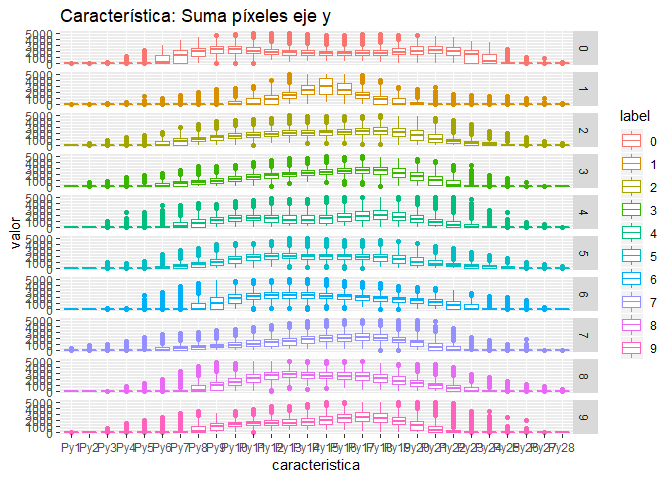

```r
suppressMessages(library(EBImage))
suppressMessages(library(rgl))
suppressMessages(library(caret))
suppressMessages(library(dplyr))
suppressMessages(library(tidyr))
suppressMessages(library(kknn))
suppressMessages(library(randomForest))
suppressMessages(library(ggplot2))
```

# Resumen

MNIST ("Instituto Nacional Modificado de Estándares y Tecnología") es el conjunto de datos de facto de "visión mundial" de la visión de computadora. Desde su lanzamiento en 1999, este clásico conjunto de datos de imágenes manuscritas ha servido como base para los algoritmos de clasificación de referencia. A medida que surgen nuevas técnicas de aprendizaje automático, MNIST sigue siendo un recurso confiable para investigadores y estudiantes por igual.


El conjunto de datos mixto de Instituto Nacional de estándares y tecnología (MNIST) es una colección de 70.000 pequeñas imágenes de dígitos escritos a mano. Los datos fue creados para actuar como un referente para los algoritmos de reconocimiento de imagen. Aunque MNIST las imágenes son pequeñas (28 x 28 pixeles) y sólo hay 10 dígitos posibles (cero a nueve) a reconocer y hay 42.0000 imágenes de formación para la creación de un modelo de reconocimiento de imagen (con 28.000 imágenes tendidas a probar la exactitud de un modelo), la experiencia ha demostrado que reconocer las imágenes MNIST es un problema difícil.

Para lidiar con este problema vamos a extraer características de cada imagen y disminuir el tamaño de cada muestra. Con esto probaremos el desempeño de clasificadores.

# Extraccion de características

Al revisar los datos tenemos un archivo con 42000 imágenes con 785 variables (28x28 píxeles) cada una, esto resulta en 33 millones de datos aproximadamente. Donde la primera columna es el número en la imagen y las 784 restantes corresponden a la imagen del número, como se puede er en la imagen siguiente (primeros 250 dígitos).


```r
# lee archivo con datos de entrenamiento (imagenes de 28x28)
train <- read.csv("train.csv")
train$label <- factor(train$label)
train[,c(2:785)] <- round(train[,c(2:785)], digits = 0)

dim(train)
```

```
[1] 42000   785
```

```r
str(train[,1:10])
```

```
'data.frame':	42000 obs. of  10 variables:
 $ label : Factor w/ 10 levels "0","1","2","3",..: 2 1 2 5 1 1 8 4 6 4 ...
 $ pixel0: num  0 0 0 0 0 0 0 0 0 0 ...
 $ pixel1: num  0 0 0 0 0 0 0 0 0 0 ...
 $ pixel2: num  0 0 0 0 0 0 0 0 0 0 ...
 $ pixel3: num  0 0 0 0 0 0 0 0 0 0 ...
 $ pixel4: num  0 0 0 0 0 0 0 0 0 0 ...
 $ pixel5: num  0 0 0 0 0 0 0 0 0 0 ...
 $ pixel6: num  0 0 0 0 0 0 0 0 0 0 ...
 $ pixel7: num  0 0 0 0 0 0 0 0 0 0 ...
 $ pixel8: num  0 0 0 0 0 0 0 0 0 0 ...
```

```r
l <- 1
for (i in 1:10) {
      for (k in 1:25) {
            if(k==1){
                  b <- matrix(unlist(train[l,-1])/255, ncol = 28, nrow = 28)
            }
            if(k>1){
                  a <- matrix(unlist(train[l,-1])/255, ncol = 28, nrow = 28)
                  b <- rbind(b,a) 
            }
            l <- l+1
      }
      if(i==1){
            c <- b
            remove(b)
      }
      if(i>1){
            c <- cbind(c,b)
            remove(b)
      }
}

display(colormap(c, palette = topo.colors(256)), method = "raster")
title("Primeros 250 dígitos escritos a mano")
```

<!-- -->

Para disminuir la gran cantidad de datos es necesario realizar algunas transformaciones y extraer información resumida de la imagen. En este caso consideraremos los siguientes pasos:

- **Reagrupar píxeles**: Se ordenarán los píxeles en matrices de 28 x 28.
- **Extraer características**:
      - **Suma Vertical**: Se cálcula la suma de todas las filas para cada columna.
      
      > $P_y = \sum_{i=1}^{28} Im(i,j=1:28)$
      
      - **Suma Horizontal**: Se cálcula la suma de todas las columnas para cada fila
      
      > $P_x = \sum_{j=1}^{28} Im(i=1:28,j)$
      
      - **Diferencia Vertical**: Se cálcula la suma de las diferencias absolutas de filas para cada columna
      
      > $S_y = \sum_{i=1}^{27} |Im(i+1,j=1:28) - Im(i,j=1:28)|$
      
      - **Diferencia Horizontal**: Se cálcula la suma de las diferencias absolutas de filas para cada columna
      
      > $S_x = \sum_{j=1}^{27} |Im(i=1:28, j+1) - Im(i=1:28, j)|$


Con esto podemos reducir el número de dimensiones de 785 a 113, que representa alrededor de un 15% de los datos originales.

A continuación podemos observar la estructura de cada característica para cada píxel para cada clase, observando distribuciones ligeramente diferentes en cada caso, esto nos servirá a la hora de clasificar cada clase.


```r
# Extraccion de caracteristicas
t <- data.frame()
for (i in 1:dim(train)[1]) {
      a <- matrix(unlist(train[i,-1]), ncol = 28, nrow = 28)
      Py <- colSums(a)
      Px <- rowSums(a)
      Sx <- rowSums(abs(a[,2:28]-a[,1:27]))
      Sy <- colSums(abs(a[2:28,]-a[1:27,]))
      nn <- cbind(t(Px), t(Py), t(Sx), t(Sy))
      nn <- data.frame(nn, stringsAsFactors = FALSE)
      t[i,1] <- train[i,1]
      t[i,2:113] <- nn
}

nt <- "label"
for (i in 1:28) {nt <- c(nt, paste0("Py",i))}
for (i in 1:28) {nt <- c(nt, paste0("Px",i))}
for (i in 1:28) {nt <- c(nt, paste0("Sx",i))}
for (i in 1:28) {nt <- c(nt, paste0("Sy",i))}
colnames(t) <- nt
saveRDS(t,"caract_1_data.rds")
remove(nn, Sy, Sx, Py, Px, a, i, nt)
```


```r
t1 <- readRDS("caract_1_data.rds")
t1$label <- factor(t1$label)

dim(t1)
```

```
[1] 42000   113
```

```r
str(t1[,1:10])
```

```
'data.frame':	42000 obs. of  10 variables:
 $ label: Factor w/ 10 levels "0","1","2","3",..: 2 1 2 5 1 1 8 4 6 4 ...
 $ Py1  : num  0 0 0 0 0 0 0 0 0 0 ...
 $ Py2  : num  0 0 0 0 0 0 0 0 0 0 ...
 $ Py3  : num  0 0 0 0 0 0 0 0 0 0 ...
 $ Py4  : num  0 0 0 0 0 0 0 0 0 0 ...
 $ Py5  : num  0 34 0 0 0 0 0 295 0 0 ...
 $ Py6  : num  0 950 0 0 2121 ...
 $ Py7  : num  0 2451 0 248 2938 ...
 $ Py8  : num  198 3117 0 1158 3633 ...
 $ Py9  : num  1027 3782 0 1687 4282 ...
```

```r
t2 <- gather(t1, key = caracteristica, value = valor, Py1:Sy28, factor_key = TRUE)

a1 <- 1176000
a2 <- 1176000*2
a3 <- 1176000*3
a4 <- 1176000*4

ggplot(data=t2[(1+a1):a2,], aes(caracteristica, valor,color=label)) +
      geom_boxplot() + facet_grid(label~.) + ggtitle("Característica: Suma píxeles eje x")
```

<!-- -->

```r
ggplot(data=t2[1:a1,], aes(caracteristica, valor,color=label)) +
      geom_boxplot() + facet_grid(label~.) + ggtitle("Característica: Suma píxeles eje y")
```

<!-- -->

```r
ggplot(data=t2[(1+a2):a3,], aes(caracteristica, valor,color=label)) +
      geom_boxplot() + facet_grid(label~.) + ggtitle("Característica: Suma de diferencia de píxeles eje x")
```

<!-- -->

```r
ggplot(data=t2[(1+a3):a4,], aes(caracteristica, valor,color=label)) +
      geom_boxplot() + facet_grid(label~.) + ggtitle("Característica: Suma de diferencia de píxeles eje y")
```

<!-- -->


# Modelo

Antes demodelar debemos dividir los datos reducidos en conjunto de entrenamiento y prueba, con 70% y 30% del total respectivamente.

Con el conjunto de entrenamiento modelaremos 2 clasificadores:

- **LogitBoost**, Este es un algoritmo basado en arboldes de decisión. Para mayor información revisar:

      https://www.rdocumentation.org/packages/caTools/versions/1.17.1/topics/LogitBoost

- **KNN**, Este algoritmo realiza la clasificación de k-nearest neighbor de un conjunto de prueba utilizando un conjunto de entrenamiento. Para cada fila del conjunto de pruebas, se encuentran los k vectores de conjunto de entrenamiento más cercanos (según la distancia de Minkowski), y la clasificación se realiza a través del máximo de densidades del núcleo sumadas. Además se pueden predecir incluso variables ordinales y continuas. Para mayor información revisar:

      https://www.rdocumentation.org/packages/kknn/versions/1.3.1/topics/kknn


En ambos casos consideraremos para entrenamiento validación cruzada con 5 folds.

El resultado del entrenamiento se muestra a continuación.


```r
# crea conjunto entrenamiento 70%-30%
set.seed(28916022)
Index1 <- createDataPartition(y = t1$label, p = 0.7, list = FALSE)
TEST <- t1[-Index1,]
TRAIN <- t1[Index1,]
# Genera modelos
trC=trainControl(method="cv", number=5)
m="Accuracy"
# KNN
set.seed(2891)
KNNGrid <-  expand.grid(kmax = 9, distance = 1, kernel = "epanechnikov")
fitKNN <- train(label~., data=TRAIN, method="kknn", metric=m,
                trControl=trC, tuneGrid = KNNGrid)
PredKNNtrain<-predict(fitKNN, newdata=TRAIN)
PredKNNtest<-predict(fitKNN, newdata=TEST)
CM_Train_KNN <- confusionMatrix(PredKNNtrain, TRAIN$label)
CM_Test_KNN <- confusionMatrix(PredKNNtest, TEST$label)
saveRDS(fitKNN, "fitKNN.rds")
saveRDS(CM_Train_KNN, "CM_Train_KNN.rds")
saveRDS(CM_Test_KNN, "CM_Test_KNN.rds")
# LogitBoost
fitLGB <- train(label~., data=TRAIN, method="LogitBoost", metric=m, trControl=trC)
PredLGBtrain<-predict(fitLGB, newdata=TRAIN)
PredLGBtest<-predict(fitLGB, newdata=TEST)
CM_Train_LGB <- confusionMatrix(PredLGBtrain, TRAIN$label)
CM_Test_LGB <- confusionMatrix(PredLGBtest, TEST$label)
saveRDS(fitLGB, "fitLGB.rds")
saveRDS(CM_Train_LGB, "CM_Train_LGB.rds")
saveRDS(CM_Test_LGB, "CM_Test_LGB.rds")
```


```r
fitKNN <- readRDS("fitKNN.rds")
fitLGB <- readRDS("fitLGB.rds")

fitKNN
```

```
k-Nearest Neighbors 

29404 samples
  112 predictor
   10 classes: '0', '1', '2', '3', '4', '5', '6', '7', '8', '9' 

No pre-processing
Resampling: Cross-Validated (5 fold) 
Summary of sample sizes: 23523, 23525, 23523, 23524, 23521 
Resampling results:

  Accuracy   Kappa    
  0.9414366  0.9349059

Tuning parameter 'kmax' was held constant at a value of 9
Tuning
 parameter 'distance' was held constant at a value of 1
Tuning
 parameter 'kernel' was held constant at a value of epanechnikov
```

```r
fitLGB
```

```
Boosted Logistic Regression 

29404 samples
  112 predictor
   10 classes: '0', '1', '2', '3', '4', '5', '6', '7', '8', '9' 

No pre-processing
Resampling: Cross-Validated (5 fold) 
Summary of sample sizes: 23522, 23522, 23522, 23527, 23523 
Resampling results across tuning parameters:

  nIter  Accuracy   Kappa    
  11     0.8979573  0.8864227
  21     0.9192840  0.9102241
  31     0.9251038  0.9167168

Accuracy was used to select the optimal model using the largest value.
The final value used for the model was nIter = 31.
```


# Pruebas

Ambos clasificadores presentan un buen desempeño para clasificar digitos. Ahora se muestra el resultado de las pruebas con el 30% de datos asignado al conjunto de pruebas.


```r
CM_Test_KNN <- readRDS("CM_Test_KNN.rds")
CM_Test_LGB <- readRDS("CM_Test_LGB.rds")

CM_Test_KNN
```

```
Confusion Matrix and Statistics

          Reference
Prediction    0    1    2    3    4    5    6    7    8    9
         0 1231    0   10    4    4    2    7    0   19    5
         1    0 1392    5    3    3    5    2   11    6    2
         2    0   10 1102   15    1   18    4    1    3    1
         3    0    0   24 1167    0   60    0    5    9    7
         4    1    1    1    0 1187    0    1    4    3    9
         5    1    1   48   53    0 1016    3    5   12    0
         6    4    1   36    4    1   14 1221    0   10    0
         7    1    0   14   40    0   16    0 1277    6   19
         8    1    0   11    8    1    4    3    0 1139    6
         9    0    0    2   11   24    3    0   17   11 1207

Overall Statistics
                                          
               Accuracy : 0.9478          
                 95% CI : (0.9438, 0.9517)
    No Information Rate : 0.1115          
    P-Value [Acc > NIR] : < 2.2e-16       
                                          
                  Kappa : 0.942           
 Mcnemar's Test P-Value : NA              

Statistics by Class:

                     Class: 0 Class: 1 Class: 2 Class: 3 Class: 4 Class: 5
Sensitivity           0.99354   0.9907  0.87949  0.89425  0.97215  0.89279
Specificity           0.99551   0.9967  0.99533  0.99070  0.99824  0.98927
Pos Pred Value        0.96022   0.9741  0.95411  0.91745  0.98343  0.89201
Neg Pred Value        0.99929   0.9988  0.98680  0.98781  0.99701  0.98935
Prevalence            0.09836   0.1115  0.09948  0.10360  0.09694  0.09035
Detection Rate        0.09773   0.1105  0.08749  0.09265  0.09424  0.08066
Detection Prevalence  0.10178   0.1134  0.09170  0.10098  0.09582  0.09043
Balanced Accuracy     0.99453   0.9937  0.93741  0.94248  0.98520  0.94103
                     Class: 6 Class: 7 Class: 8 Class: 9
Sensitivity           0.98388   0.9674  0.93514  0.96099
Specificity           0.99384   0.9915  0.99701  0.99400
Pos Pred Value        0.94578   0.9301  0.97101  0.94667
Neg Pred Value        0.99823   0.9962  0.99308  0.99567
Prevalence            0.09852   0.1048  0.09670  0.09971
Detection Rate        0.09694   0.1014  0.09043  0.09582
Detection Prevalence  0.10249   0.1090  0.09312  0.10122
Balanced Accuracy     0.98886   0.9795  0.96608  0.97750
```

```r
CM_Test_LGB
```

```
Confusion Matrix and Statistics

          Reference
Prediction    0    1    2    3    4    5    6    7    8    9
         0 1168    0    2    1    4    1    3    1    6    4
         1    0 1369    4    1    1    2    3    3    3    1
         2    4   11  984   30    5   20   16    6    7    0
         3    1    2   22 1035    1   60    0    6   12   17
         4    1    0    3    0 1128    1   10    6    1   23
         5    3    1   72   62    2  898   12   14   23    7
         6    6    0   25    2    8    9 1156    1    7    0
         7    1    2   14   26    1   17    0 1194    4   40
         8   14    0   18   16    2   18    4    1 1069   10
         9    2    0    3   11   28    2    0   24    9 1046

Overall Statistics
                                          
               Accuracy : 0.9304          
                 95% CI : (0.9257, 0.9349)
    No Information Rate : 0.1167          
    P-Value [Acc > NIR] : < 2.2e-16       
                                          
                  Kappa : 0.9227          
 Mcnemar's Test P-Value : NA              

Statistics by Class:

                     Class: 0 Class: 1 Class: 2 Class: 3 Class: 4 Class: 5
Sensitivity           0.97333   0.9884  0.85789  0.87416  0.95593  0.87354
Specificity           0.99794   0.9983  0.99077  0.98868  0.99579  0.98193
Pos Pred Value        0.98151   0.9870  0.90859  0.89533  0.96164  0.82084
Neg Pred Value        0.99700   0.9985  0.98489  0.98610  0.99514  0.98794
Prevalence            0.10107   0.1167  0.09661  0.09972  0.09939  0.08658
Detection Rate        0.09837   0.1153  0.08288  0.08717  0.09501  0.07563
Detection Prevalence  0.10023   0.1168  0.09122  0.09736  0.09880  0.09214
Balanced Accuracy     0.98564   0.9934  0.92433  0.93142  0.97586  0.92773
                     Class: 6 Class: 7 Class: 8 Class: 9
Sensitivity           0.96013   0.9506  0.93690  0.91115
Specificity           0.99456   0.9901  0.99227  0.99263
Pos Pred Value        0.95222   0.9192  0.92795  0.92978
Neg Pred Value        0.99550   0.9941  0.99328  0.99051
Prevalence            0.10141   0.1058  0.09610  0.09669
Detection Rate        0.09736   0.1006  0.09004  0.08810
Detection Prevalence  0.10225   0.1094  0.09703  0.09475
Balanced Accuracy     0.97735   0.9704  0.96458  0.95189
```

El resultado es similar al entrenamiento, por lo que ambos clasificadores funcionan bien y no están sobre entrenados.

---

# Conclusiones

Ambos clasificadores presentan un buen desempeño superior al 92%.

La reduccion de dimensiones permitió reducir el tiempo de ejecución en mi computador, aunque de todas maneras tomó un tiempo considerable. Esto es importante, ya que si consideramos un problema similar con imagenes más grandes la cantidad de dimensiones amentaría.

Para solucionar esto se podría implementar otro preprocesamiento adicional a la extracción de las carácterísticas desarrollado, como análisis PCA y así reducir aún más la cantidad de dimensiones. Otra opción es extraer carácterísticas no por píxel sino por clase, lo que reduciría la dimensionalidad a 11 variables.

---

# Referencia

Para revisar el código de este trabajo ir a:

https://github.com/desareca/Procesamiento-Imagenes-R

---

# Información de sesión


```r
sessionInfo()
```

```
R version 3.5.2 (2018-12-20)
Platform: x86_64-w64-mingw32/x64 (64-bit)
Running under: Windows 10 x64 (build 17134)

Matrix products: default

locale:
[1] LC_COLLATE=Spanish_Chile.1252  LC_CTYPE=Spanish_Chile.1252   
[3] LC_MONETARY=Spanish_Chile.1252 LC_NUMERIC=C                  
[5] LC_TIME=Spanish_Chile.1252    

attached base packages:
[1] stats     graphics  grDevices utils     datasets  methods   base     

other attached packages:
[1] randomForest_4.6-14 kknn_1.3.1          tidyr_0.8.3        
[4] dplyr_0.8.0.1       caret_6.0-81        ggplot2_3.1.0      
[7] lattice_0.20-38     rgl_0.99.16         EBImage_4.24.0     

loaded via a namespace (and not attached):
 [1] jsonlite_1.6            splines_3.5.2          
 [3] foreach_1.4.4           prodlim_2018.04.18     
 [5] shiny_1.2.0             assertthat_0.2.0       
 [7] stats4_3.5.2            tiff_0.1-5             
 [9] yaml_2.2.0              ipred_0.9-8            
[11] pillar_1.3.1            glue_1.3.0             
[13] digest_0.6.18           manipulateWidget_0.10.0
[15] promises_1.0.1          colorspace_1.4-0       
[17] recipes_0.1.4           htmltools_0.3.6        
[19] httpuv_1.4.5.1          Matrix_1.2-15          
[21] plyr_1.8.4              timeDate_3043.102      
[23] pkgconfig_2.0.2         purrr_0.3.1            
[25] xtable_1.8-3            fftwtools_0.9-8        
[27] scales_1.0.0            webshot_0.5.1          
[29] jpeg_0.1-8              later_0.8.0            
[31] gower_0.1.2             lava_1.6.5             
[33] tibble_2.0.1            generics_0.0.2         
[35] withr_2.1.2             nnet_7.3-12            
[37] BiocGenerics_0.28.0     lazyeval_0.2.1         
[39] survival_2.43-3         magrittr_1.5           
[41] crayon_1.3.4            mime_0.6               
[43] evaluate_0.13           nlme_3.1-137           
[45] MASS_7.3-51.1           class_7.3-14           
[47] tools_3.5.2             data.table_1.12.0      
[49] stringr_1.4.0           munsell_0.5.0          
[51] locfit_1.5-9.1          compiler_3.5.2         
[53] rlang_0.3.1             grid_3.5.2             
[55] RCurl_1.95-4.11         iterators_1.0.10       
[57] htmlwidgets_1.3         igraph_1.2.4           
[59] crosstalk_1.0.0         miniUI_0.1.1.1         
[61] bitops_1.0-6            rmarkdown_1.11         
[63] gtable_0.2.0            ModelMetrics_1.2.2     
[65] codetools_0.2-15        abind_1.4-5            
[67] reshape2_1.4.3          R6_2.4.0               
[69] lubridate_1.7.4         knitr_1.21             
[71] stringi_1.3.1           parallel_3.5.2         
[73] Rcpp_1.0.0              rpart_4.1-13           
[75] png_0.1-7               tidyselect_0.2.5       
[77] xfun_0.5               
```


