```r
library(EBImage)
library(fftwtools)
library(rgl)
source("surf3d.R") # muestra imagen en 3d
source("filtro.R") # ejecuta un filtro a una imagen en dominio espacial
source("fftshift.R") # traslada el espectro de frecuencias al centro de la imagen
```

## Resumen

El siguiente trabajo presenta una implementación simple de detección de bordes utilizando R.
Para el tratamiento de imagenes se utilizó el paquete [EBImage](https://www.bioconductor.org/packages/devel/bioc/vignettes/EBImage/inst/doc/EBImage-introduction.html), que proporciona una funcionalidad de propósito general para el procesamiento y análisis de imágenes.


## Detección de bordes

Para este primer análisis vamos a considerar una imagen con monedas como se muestra acontinuación. Esta es una imagen clasica en detección de bordes y se puede encontrar en el siguiente link:

- [Detector de bordes Canny cómo contar objetos con OpenCV y Python](https://programarfacil.com/blog/vision-artificial/detector-de-bordes-canny-opencv/)


```r
monedas = readImage("monedas.jpg")
display(monedas, "raster")
```

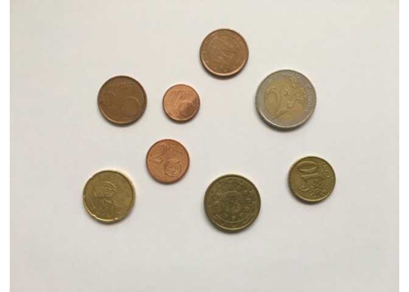<!-- -->

```r
print(monedas, short=TRUE)
```

```
Image 
  colorMode    : Color 
  storage.mode : double 
  dim          : 500 375 3 
  frames.total : 3 
  frames.render: 1 
```

Consideraremos realizar la deteccion de bordes en 3 pasos:

- Filtrar ruido (suavizar imagen).
- Generar bordes.
- Eliminar información no relevante (mediante umbral).

### Filtrar Ruido

Un paso de preprocesamiento común consiste en limpiar las imágenes mediante la eliminación de artefactos locales o el ruido a través del suavizado. Un enfoque intuitivo es definir una ventana de un tamaño seleccionado alrededor de cada píxel y promediar los valores dentro de ese vecindario. Después de aplicar este procedimiento a todos los píxeles, se obtiene la nueva imagen suavizada.

En nuestro caso vamos a revisar 2 técnicas de suavizado, un filtro gaussiano y un filtro de mediana. Para demostrar su funcionamiento, primero modificaremos la imagen con ruido uniforme y luego la reconstruiremos mediante los 2 filtros.


```r
lm = length(monedas)
img_noisy1 = monedas
img_noisy2 = monedas
img_noisy3 = monedas
img_noisy4 = monedas
img_noisy5 = monedas

img_noisy1[sample(lm, lm/10)] = runif(lm/10, min=0, max=1)
img_noisy2[sample(lm, lm/5)] = runif(lm/5, min=0, max=1)
img_noisy3[sample(lm, lm/3)] = runif(lm/3, min=0, max=1)
img_noisy4[sample(lm, lm/2)] = runif(lm/2, min=0, max=1)
img_noisy5[sample(lm, lm/1.3)] = runif(lm/1.3, min=0, max=1)

display(combine(monedas, img_noisy1, img_noisy2, img_noisy3, 
                img_noisy4, img_noisy5), 
        all=TRUE, method = "raster")
text(x = 20, y = 20, label = "Original", adj = c(0,1),
     col = "blue", cex = 1)
text(x = 500 +20, y = 20, label = "Ruido razón: 1/10", adj = c(0,1),
     col = "blue", cex = 1)
text(x = 1000 + 20, y = 20, label = "Ruido razón: 1/5", adj = c(0,1),
     col = "blue", cex = 1)
text(x = 20, y = 375 + 20, label = "Ruido razón: 1/3", adj = c(0,1),
     col = "blue", cex = 1)
text(x = 500 +20, y =375 +  20, label = "Ruido razón: 1/2", adj = c(0,1),
     col = "blue", cex = 1)
text(x = 1000 + 20, y =375 +  20, label = "Ruido razón: 1/1.3", adj = c(0,1),
     col = "blue", cex = 1)
```

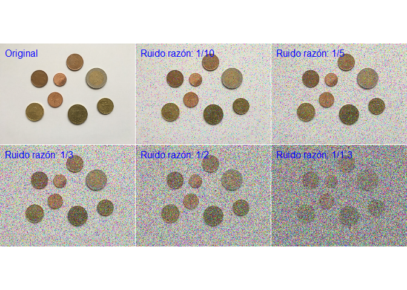<!-- -->

Como se mencionó antes, es necesario definir una ventana de un tamaño seleccionado alrededor de cada píxel y promediar los valores dentro de ese vecindario. 

En el caso del filtro gaussiano se considera una ventana (en la figura igual a 15), donde se aplica una función gaussiana (en la figura $\sigma=2$). La expresión de la función gaussiana es la siguiente:

> $F(x,y)=\frac{1}{2\pi\sigma^2}e^\frac{-(x^2+y^2)}{2\sigma^2}$


```r
w = EBImage::makeBrush(size = 15, shape = 'Gaussian', sigma = 2)
plot(w[(nrow(w)+1)/2, ], ylab = "w", xlab = "", cex = 0.7, main = "Filtro Gaussiano Pasa Bajos")
```

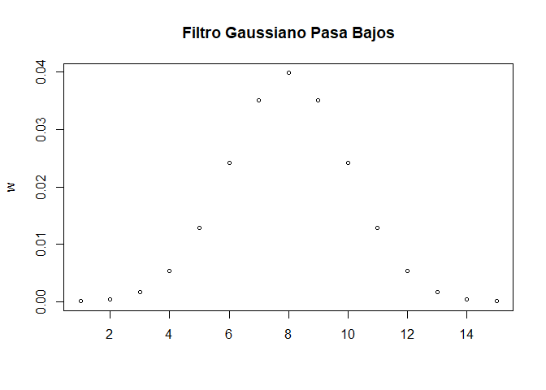<!-- -->

Para el análisis se consideran 2 filtros con $\sigma=1$ y $\sigma=5$, en ambos casos una ventana de 7 pixeles.


```r
Fgauss1 = filtro(monedas, w=NULL, size = 7, sigma = 1,
                       inverse = FALSE)
Fgauss2 = filtro(img_noisy1, w=NULL, size = 7, sigma = 1,
                       inverse = FALSE)
Fgauss3 = filtro(img_noisy3, w=NULL, size = 7, sigma = 1,
                       inverse = FALSE)

Fgauss4 = filtro(monedas, w=NULL, size = 7, sigma = 5,
                       inverse = FALSE)
Fgauss5 = filtro(img_noisy1, w=NULL, size = 7, sigma = 5,
                       inverse = FALSE)
Fgauss6 = filtro(img_noisy3, w=NULL, size = 7, sigma = 5,
                       inverse = FALSE)

Fgauss7 = filtro(img_noisy5, w=NULL, size = 7, sigma = 1,
                       inverse = FALSE)
Fgauss8 = filtro(img_noisy5, w=NULL, size = 7, sigma = 5,
                       inverse = FALSE)

display(combine(monedas, img_noisy1, img_noisy3,
                Fgauss1, Fgauss2, Fgauss3, 
                Fgauss4, Fgauss5, Fgauss6), 
        all=TRUE, method = "raster")
text(x = 20, y = 20, label = "Original", adj = c(0,1),
     col = "blue", cex = 1)
text(x = 500 +20, y = 20, label = "Ruido razón: 1/10", adj = c(0,1),
     col = "blue", cex = 1)
text(x = 1000 + 20, y = 20, label = "Ruido razón: 1/3", adj = c(0,1),
     col = "blue", cex = 1)

text(x = 20, y = 375 + 20, label = "Original", adj = c(0,1),
     col = "blue", cex = 1)
text(x = 20, y = 375 + 60, label = "Sigma: 1", adj = c(0,1),
     col = "blue", cex = 1)
text(x = 500 + 20, y =375 +  20, label = "Ruido razón: 1/10", adj = c(0,1),
     col = "blue", cex = 1)
text(x = 500 + 20, y = 375 + 60, label = "Sigma: 1", adj = c(0,1),
     col = "blue", cex = 1)
text(x = 1000 + 20, y =375 +  20, label = "Ruido razón: 1/3", adj = c(0,1),
     col = "blue", cex = 1)
text(x = 1000 + 20, y = 375 + 60, label = "Sigma: 1", adj = c(0,1),
     col = "blue", cex = 1)

text(x = 20, y = 750 + 20, label = "Original", adj = c(0,1),
     col = "blue", cex = 1)
text(x = 20, y = 750 + 60, label = "Sigma: 3", adj = c(0,1),
     col = "blue", cex = 1)
text(x = 500 + 20, y =750 +  20, label = "Ruido razón: 1/10", adj = c(0,1),
     col = "blue", cex = 1)
text(x = 500 + 20, y = 750 + 60, label = "Sigma: 3", adj = c(0,1),
     col = "blue", cex = 1)
text(x = 1000 + 20, y =750 +  20, label = "Ruido razón: 1/3", adj = c(0,1),
     col = "blue", cex = 1)
text(x = 1000 + 20, y = 750 + 60, label = "Sigma: 3", adj = c(0,1),
     col = "blue", cex = 1)
```

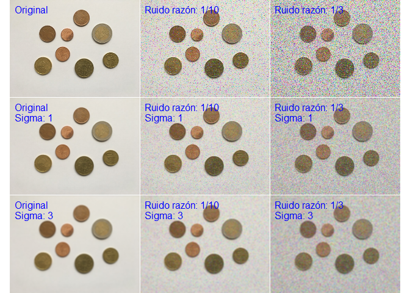<!-- -->


Otro método para realizar la reducción de ruido es aplicar un filtro de mediana, que es una técnica no lineal en oposición al filtro de convolución de paso bajo descrito anteriormente. Este es similar al filtro anterior, pero en lugar de promediar los datos, los reordena de mayor a menor (o viceversa) y selecciona el valor central.

El filtrado por mediana es particularmente efectivo en el caso del ruido de sal y pimienta, y tiene la ventaja de eliminar el ruido y preservar los bordes. Aunque tiene la desventaja de mayor costo computacional, esto resultamás evidentes en imagágenes con mayores dimensiones.


```r
Fmediana1 = medianFilter(monedas, 1)
Fmediana2 = medianFilter(img_noisy1, 1)
Fmediana3 = medianFilter(img_noisy3, 1)

Fmediana4 = medianFilter(monedas, 2)
Fmediana5 = medianFilter(img_noisy1, 2)
Fmediana6 = medianFilter(img_noisy3, 2)

Fmediana7 = medianFilter(img_noisy5, 1)
Fmediana8 = medianFilter(img_noisy5, 2)

display(combine(monedas, img_noisy1, img_noisy3,
                Fmediana1, Fmediana2, Fmediana3, 
                Fmediana4, Fmediana5, Fmediana6), 
        all=TRUE, method = "raster")
text(x = 20, y = 20, label = "Original", adj = c(0,1),
     col = "blue", cex = 1)
text(x = 500 +20, y = 20, label = "Ruido razón: 1/10", adj = c(0,1),
     col = "blue", cex = 1)
text(x = 1000 + 20, y = 20, label = "Ruido razón: 1/3", adj = c(0,1),
     col = "blue", cex = 1)

text(x = 20, y = 375 + 20, label = "Original", adj = c(0,1),
     col = "blue", cex = 1)
text(x = 20, y = 375 + 60, label = "Ventana: 1", adj = c(0,1),
     col = "blue", cex = 1)
text(x = 500 + 20, y =375 +  20, label = "Ruido razón: 1/10", adj = c(0,1),
     col = "blue", cex = 1)
text(x = 500 + 20, y = 375 + 60, label = "Ventana: 1", adj = c(0,1),
     col = "blue", cex = 1)
text(x = 1000 + 20, y =375 +  20, label = "Ruido razón: 1/3", adj = c(0,1),
     col = "blue", cex = 1)
text(x = 1000 + 20, y = 375 + 60, label = "Ventana: 1", adj = c(0,1),
     col = "blue", cex = 1)

text(x = 20, y = 750 + 20, label = "Original", adj = c(0,1),
     col = "blue", cex = 1)
text(x = 20, y = 750 + 60, label = "Ventana: 2", adj = c(0,1),
     col = "blue", cex = 1)
text(x = 500 + 20, y =750 +  20, label = "Ruido razón: 1/10", adj = c(0,1),
     col = "blue", cex = 1)
text(x = 500 + 20, y = 750 + 60, label = "Ventana: 2", adj = c(0,1),
     col = "blue", cex = 1)
text(x = 1000 + 20, y =750 +  20, label = "Ruido razón: 1/3", adj = c(0,1),
     col = "blue", cex = 1)
text(x = 1000 + 20, y = 750 + 60, label = "Ventana: 2", adj = c(0,1),
     col = "blue", cex = 1)
```

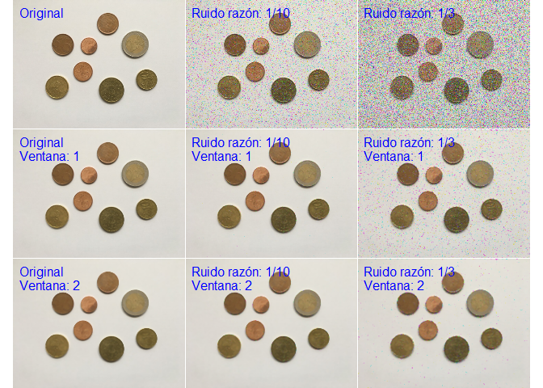<!-- -->


Para evaluar que filtros tienen mejor desempeño realizaremos la correlación de estos con la imagen original, mientras más cercano a uno, mejor desepeño tiene el filtro.


```r
tab1 <- rbind(cbind(cor(monedas, monedas), cor(monedas, img_noisy1),
                    cor(monedas, img_noisy3)),
              cbind(cor(monedas, Fgauss1), cor(monedas, Fgauss2), 
                    cor(monedas, Fgauss3)),
              cbind(cor(monedas, Fgauss4), cor(monedas, Fgauss5), 
                    cor(monedas, Fgauss6)),
              cbind(cor(monedas, Fmediana1), cor(monedas, Fmediana2),
                    cor(monedas, Fmediana3)),
              cbind(cor(monedas, Fmediana4), cor(monedas, Fmediana5),
                    cor(monedas, Fmediana6)))
colnames(tab1) <- c("Original", "Ruido (1/10)", "Ruido (1/3)")
rownames(tab1) <- c("Original", "Gaussian (1)", "Gaussian (3)",
                    "Mediana (1)", "Mediana (2)")
tab1
```

```
              Original Ruido (1/10) Ruido (1/3)
Original     1.0000000    0.7548568   0.4477316
Gaussian (1) 0.9943017    0.9645338   0.8617195
Gaussian (3) 0.9823528    0.9741774   0.9413183
Mediana (1)  0.9964838    0.9946613   0.9349224
Mediana (2)  0.9924976    0.9914046   0.9838853
```

Dado los resultados, utilizaremos el filtro de mediana de ventana 2.

En general hay que tener en consideración que la elección del filtro depende en gran medida de las condiciones de la imagen (luz, contraste, etc) y el tipo de ruido presente en la imagen, por lo que se deben evaluar más condiciones de las vistas en este trabajo. Por otro lado, se pueden seleccionar varios filtros, lo que podría mejorar aún más el desempeño, pero aumentando el costo computacional. 


### Generar bordes.

Para generar los bordes utilizaremos el filtro gaussiano pasa bajos con una modificación, esta es le restaremos la media y dividiremos todo por la desviación estandar.

Tal como se muestra a continuación, con este arreglo se genera una función que permite pasar las frecuencias más altas de la imagen.


```r
w = (mean(w) - w)/sd(w)
plot(w[(nrow(w)+1)/2, ], ylab = "w", xlab = "", cex = 0.7, main = "Filtro Gaussiano Pasa Altos")
```

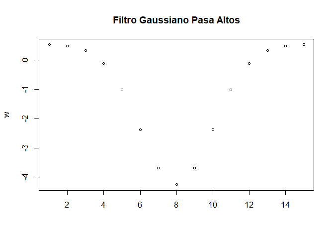<!-- -->

Para extraer bordes vamos a utilizar una ventana de 7 y $\sigma=1$:


```r
size <- 7
sigma <- 1
FPA1 = filtro(monedas, w=NULL, size = size,
              sigma = sigma, inverse = TRUE)
FPA2 = filtro(img_noisy1, w=NULL, size = size,
              sigma = sigma, inverse = TRUE)
FPA3 = filtro(img_noisy3, w=NULL, size = size,
              sigma = sigma, inverse = TRUE)
FPA4 = filtro(Fmediana4, w=NULL, size = size,
              sigma = sigma, inverse = TRUE)
FPA5 = filtro(Fmediana5, w=NULL, size = size,
              sigma = sigma, inverse = TRUE)
FPA6 = filtro(Fmediana6, w=NULL, size = size,
              sigma = sigma, inverse = TRUE)

display(combine(monedas, img_noisy1, img_noisy3,
                FPA4, FPA5, FPA6), 
        all=TRUE, method = "raster")
text(x = 20, y = 20, label = "Original", adj = c(0,1),
     col = "blue", cex = 1)
text(x = 500 +20, y = 20, label = "Ruido razón: 1/10", adj = c(0,1),
     col = "blue", cex = 1)
text(x = 1000 + 20, y = 20, label = "Ruido razón: 1/3", adj = c(0,1),
     col = "blue", cex = 1)
```

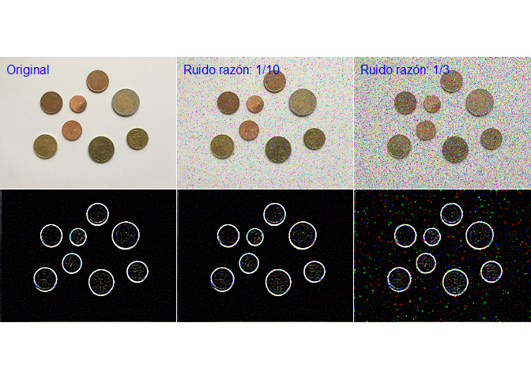<!-- -->


### Eliminar información no relevante (mediante umbral)

Para esto vamos a utilizar umbrales adaptativos de una imagen utilizando una ventana rectangular en movimiento. Esto se realiza comparando la imagen original con una versión filtrada con una ventana rectangular.

El resultado es la eliminación a los valores menores a un umbral fijo. 
En este caso utilizaremos un umbral igual a **0.7** y una ventana de **10 x 10**.


```r
U <- 0.7
umbral <- U
# umbral = U*(range(FPA4)[2] - range(FPA4)[1])
img_end1 <- thresh(FPA4, offset=umbral, w = 10, h = 10)

# umbral = U*(range(FPA5)[2] - range(FPA5)[1])
img_end2 <- thresh(FPA5, offset=umbral, w = 10, h = 10)

# umbral = U*(range(FPA6)[2] - range(FPA6)[1])
img_end3 <- thresh(FPA6, offset=umbral, w = 10, h = 10)


display(combine(monedas, img_noisy1, img_noisy3,
                FPA4, FPA5, FPA6,
                img_end1, img_end2, img_end3), 
        all=TRUE, method = "raster")
text(x = 20, y = 20, label = "Original", adj = c(0,1),
     col = "blue", cex = 1)
text(x = 500 +20, y = 20, label = "Ruido razón: 1/10", adj = c(0,1),
     col = "blue", cex = 1)
text(x = 1000 + 20, y = 20, label = "Ruido razón: 1/3", adj = c(0,1),
     col = "blue", cex = 1)
```

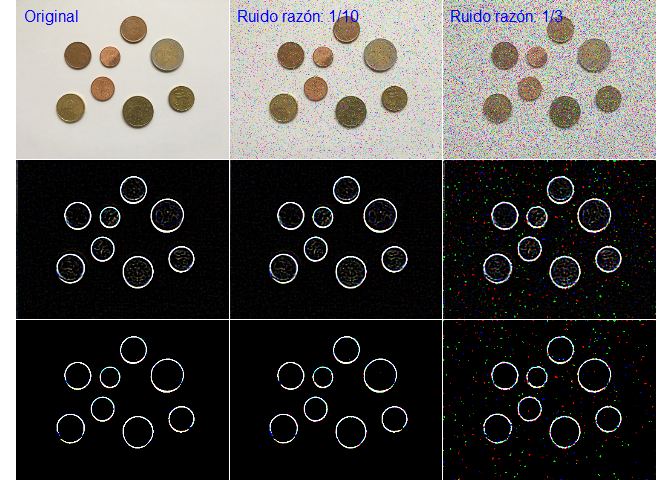<!-- -->

## Ejemplos

Acontinuación se muestran algunos ejemplos aplicando filtros para generar bordes en la imagen. En estos ejemplos se consideró pasar la imagen por un filtro de mediana y luego por un filtro gaussiano pasa bajos  antes de aplicar el filtro gaussiano pasa altos.


```r
ejemplos <- function(img, size = 7, sigma = 1, umbral = .7,
                     ventana = c(10,10), color = c(1,1,1), cont = 0.5){
      library(EBImage)
      img_m = medianFilter(img, 2)
      FPB = filtro(img_m, w=NULL, size = 7,
                    sigma = 7, inverse = FALSE)
      FPA = filtro(FPB, w=NULL, size = size,
                    sigma = sigma, inverse = TRUE)
      img_end <- thresh(FPA, offset=umbral,
                        w = ventana[1], h = ventana[2])
      colorMatrix <- img
      for (k in 1:dim(img)[3]) {
            colorMatrix[,,k] <- color[k]
      }
      img_end <- img_end*colorMatrix + cont*img
      img_end
      
}
```

- Referencia: [Monedas](https://programarfacil.com/blog/vision-artificial/detector-de-bordes-canny-opencv/)
      + Filtro mediana: $Ventana=2$
      + Filtro Gaussiano Pasa Bajos: $Ventana=7$, $\sigma=7$
      + Filtro Gaussiano Pasa Altos: $Ventana=7$, $\sigma=1.1$
      + Umbral: $.35$


```r
library(EBImage)
img <- readImage("monedas.jpg")
ejemplo1 <- ejemplos(img, size = 7, sigma = 1.1,
                     umbral = .35, ventana = c(20,20),
                     color = c(1,1,1), cont = 0.5)
display(combine(img, ejemplo1), all=TRUE, method = "raster")
```

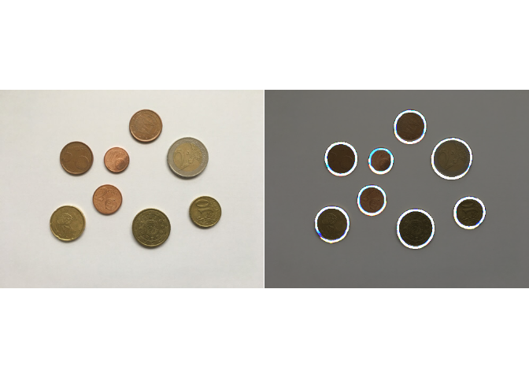<!-- -->

- Referencia: [Pajaro](https://www.google.com/url?sa=i&source=imgres&cd=&cad=rja&uact=8&ved=2ahUKEwiLoZG88sjgAhXlCtQKHR_9CW0QjRx6BAgBEAU&url=http%3A%2F%2Fcosasquecontartealaluzdelasestrellas.blogspot.com%2F2015%2F06%2Fel-pajaro-azul-de-la-felicidad.html&psig=AOvVaw1XDpfY86IbhNh9YToC5pOV&ust=1550703394336175)
      + Filtro mediana: $Ventana=2$
      + Filtro Gaussiano Pasa Bajos: $Ventana=7$, $\sigma=7$
      + Filtro Gaussiano Pasa Altos: $Ventana=7$, $\sigma=1.5$
      + Umbral: $.1$


```r
library(EBImage)
img <- readImage("pajaro.jpg")
ejemplo2 <- ejemplos(img, size = 7, sigma = 1.5,
                     umbral = .1, ventana = c(15,15),
                     color = c(1,1,1), cont = 0.3)
display(combine(img, ejemplo2), all=TRUE, method = "raster")
```

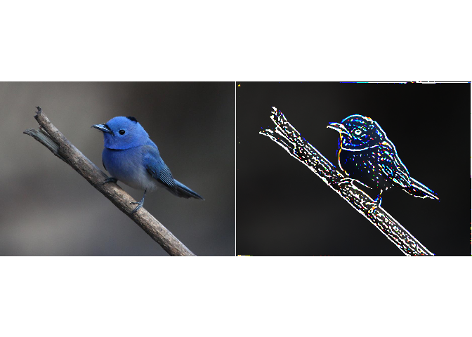<!-- -->

- Referencia: [Edificio](https://www.google.com/imgres?imgurl=https%3A%2F%2Fwww.amatimmobiliaris.com%2Fw%2Fwp-content%2Fuploads%2FEdificio_Espaa_Madrid_04.jpg&imgrefurl=https%3A%2F%2Fwww.amatimmobiliaris.com%2Fw%2Fcual-es-la-historia-del-edificio-espana%2F&docid=IrnnRmUZXtT_MM&tbnid=djhJiU4xvRPNkM%3A&vet=10ahUKEwj2u4Tl88jgAhVEGbkGHZ5tBTwQMwhGKAcwBw..i&w=4307&h=3223&bih=818&biw=1821&q=edificio%20wiki&ved=0ahUKEwj2u4Tl88jgAhVEGbkGHZ5tBTwQMwhGKAcwBw&iact=mrc&uact=8)
      + Filtro mediana: $Ventana=2$
      + Filtro Gaussiano Pasa Bajos: $Ventana=7$, $\sigma=7$
      + Filtro Gaussiano Pasa Altos: $Ventana=5$, $\sigma=1.5$
      + Umbral: $.09$


```r
library(EBImage)
img <- readImage("edificio.jpg")
ejemplo3 <- ejemplos(img, size = 5, sigma = 1.5,
                     umbral = .09, ventana = c(15,15),
                     color = c(1,1,1), cont = 0.3)
display(combine(img, ejemplo3), all=TRUE, method = "raster")
```

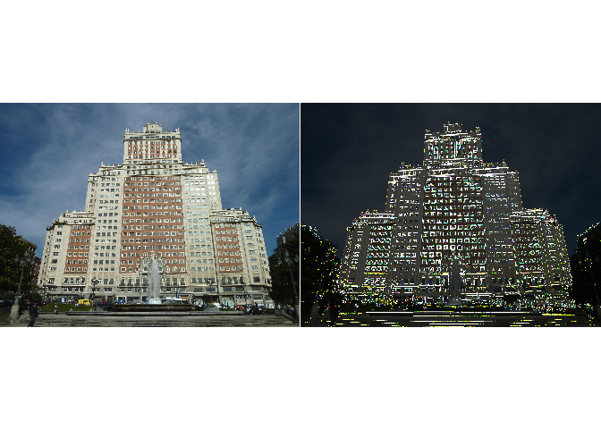<!-- -->

- Referencia: [Flores](https://www.google.com/url?sa=i&source=images&cd=&cad=rja&uact=8&ved=2ahUKEwiJoKTs9MjgAhUXHLkGHU2xD5sQjRx6BAgBEAU&url=https%3A%2F%2Fes.wikipedia.org%2Fwiki%2FArchivo%3AFlores_nagua.jpg&psig=AOvVaw0IEzvd3Hdli_aWNLrNDem9&ust=1550704005151853)
      + Filtro mediana: $Ventana=2$
      + Filtro Gaussiano Pasa Bajos: $Ventana=7$, $\sigma=7$
      + Filtro Gaussiano Pasa Altos: $Ventana=5$, $\sigma=1.5$
      + Umbral: $.05$


```r
library(EBImage)
img <- readImage("flores 1.jpg")
ejemplo4 <- ejemplos(img, size = 5, sigma = 1.5,
                     umbral = .05, ventana = c(15,15),
                     color = c(1,1,1), cont = 0.3)
display(combine(img, ejemplo4), all=TRUE, method = "raster")
```

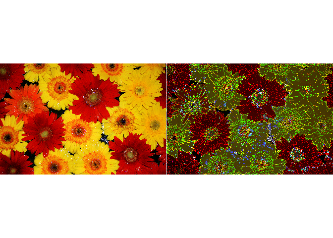<!-- -->

- Referencia: [Flor](https://www.google.com/url?sa=i&source=images&cd=&cad=rja&uact=8&ved=2ahUKEwjV87z79MjgAhWfFLkGHRxhAPkQjRx6BAgBEAU&url=https%3A%2F%2Fes.wikipedia.org%2Fwiki%2FArchivo%3ANasturtium_tropaeolum_flores.jpg&psig=AOvVaw0IEzvd3Hdli_aWNLrNDem9&ust=1550704005151853)
      + Filtro mediana: $Ventana=2$
      + Filtro Gaussiano Pasa Bajos: $Ventana=7$, $\sigma=7$
      + Filtro Gaussiano Pasa Altos: $Ventana=5$, $\sigma=1.5$
      + Umbral: $.05$


```r
library(EBImage)
img <- readImage("flores 2.jpg")
ejemplo5 <- ejemplos(img, size = 5, sigma = 1.5,
                     umbral = .05, ventana = c(15,15),
                     color = c(1,1,1), cont = 0.3)
display(combine(img, ejemplo5), all=TRUE, method = "raster")
```

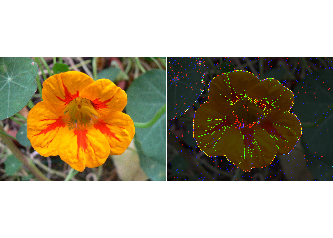<!-- -->

- Referencia: Foto muestra paquete **EBImage**
      + Filtro mediana: $Ventana=2$
      + Filtro Gaussiano Pasa Bajos: $Ventana=7$, $\sigma=7$
      + Filtro Gaussiano Pasa Altos: $Ventana=5$, $\sigma=1.5$
      + Umbral: $.09$


```r
library(EBImage)
img <- readImage("sample.jpeg")
ejemplo6 <- ejemplos(img, size = 5, sigma = 1.5,
                     umbral = .09, ventana = c(10,10),
                     color = c(1,1,1), cont = 0.3)
display(combine(img, ejemplo6), all=TRUE, method = "raster")
```

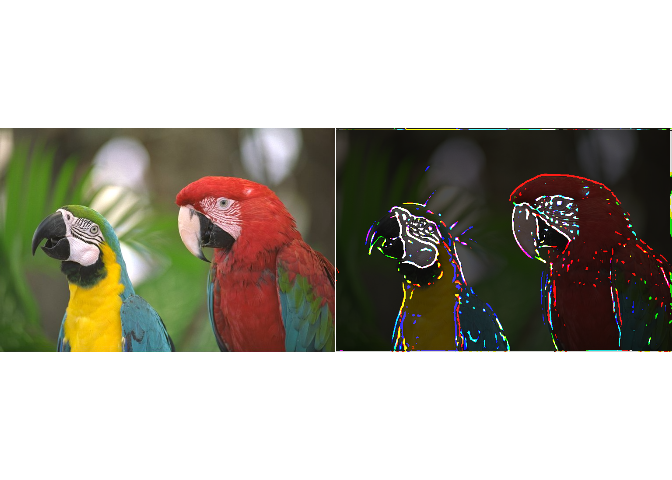<!-- -->

---

## Referencias

- Material teórico:
      + http://dirinfo.unsl.edu.ar/servicios/abm/assets/uploads/materiales/3eed3-04_pixmaps_15.pdf
      + http://www2.elo.utfsm.cl/~elo328/pdf1dpp/PDI05b_dominioEspacial_y_Error_1dpp.pdf

- Codigo:
      + https://github.com/desareca/Procesamiento-Imagenes-R

---

## Información de sesión


```r
sessionInfo()
```

```
R version 3.5.2 (2018-12-20)
Platform: x86_64-w64-mingw32/x64 (64-bit)
Running under: Windows 10 x64 (build 17134)

Matrix products: default

locale:
[1] LC_COLLATE=Spanish_Chile.1252  LC_CTYPE=Spanish_Chile.1252   
[3] LC_MONETARY=Spanish_Chile.1252 LC_NUMERIC=C                  
[5] LC_TIME=Spanish_Chile.1252    

attached base packages:
[1] stats     graphics  grDevices utils     datasets  methods   base     

other attached packages:
[1] EBImage_4.24.0

loaded via a namespace (and not attached):
 [1] locfit_1.5-9.1      Rcpp_1.0.0          lattice_0.20-38    
 [4] fftwtools_0.9-8     png_0.1-7           digest_0.6.18      
 [7] bitops_1.0-6        tiff_0.1-5          grid_3.5.2         
[10] magrittr_1.5        evaluate_0.13       stringi_1.2.4      
[13] rmarkdown_1.11      tools_3.5.2         stringr_1.4.0      
[16] htmlwidgets_1.3     RCurl_1.95-4.11     jpeg_0.1-8         
[19] xfun_0.4            yaml_2.2.0          abind_1.4-5        
[22] parallel_3.5.2      compiler_3.5.2      BiocGenerics_0.28.0
[25] htmltools_0.3.6     knitr_1.21         
```


