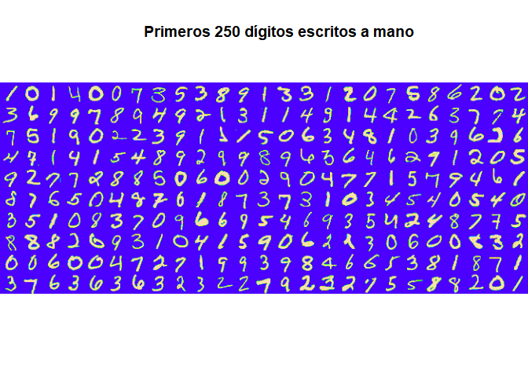
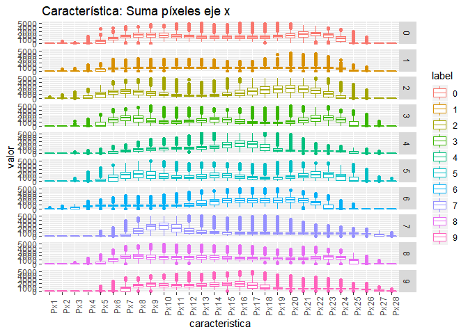
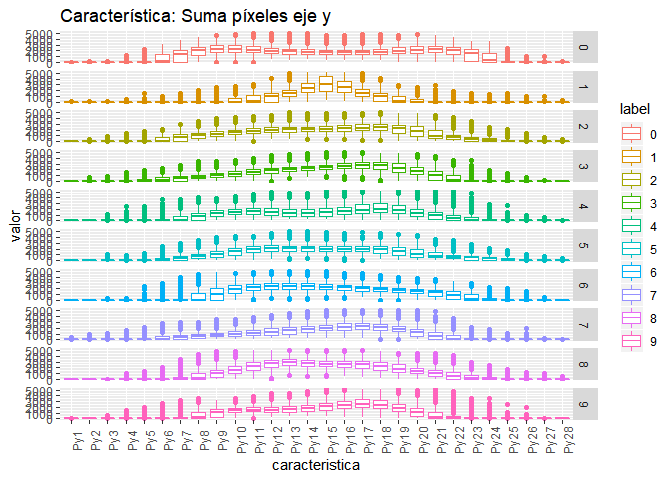
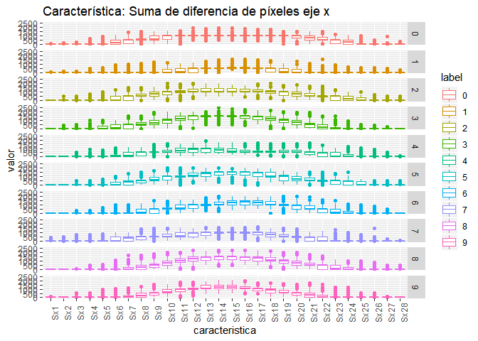
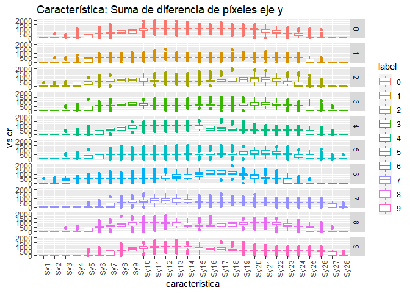
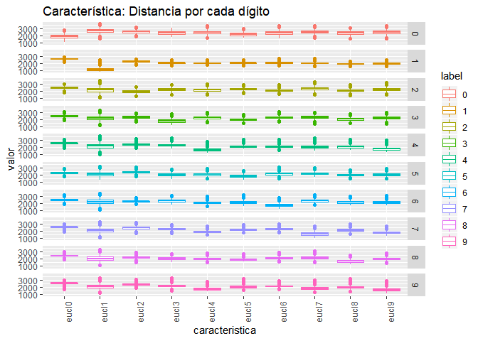
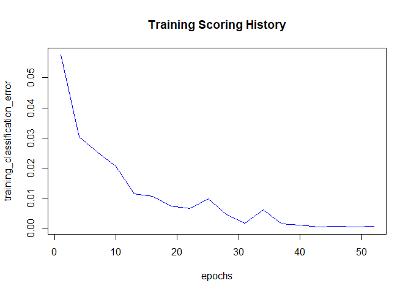
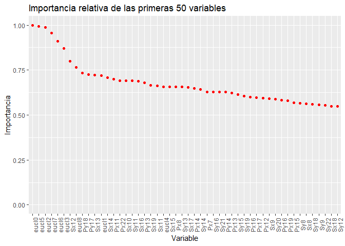

```r
suppressMessages(library(EBImage))
suppressMessages(library(rgl))
suppressMessages(library(dplyr))
suppressMessages(library(tidyr))
suppressMessages(library(ggplot2))
suppressMessages(library(h2o))
```

# Resumen

MNIST ("Instituto Nacional Modificado de Estándares y Tecnología") es el conjunto de datos de facto de "visión mundial" de la visión de computadora. Desde su lanzamiento en 1999, este clásico conjunto de datos de imágenes manuscritas ha servido como base para los algoritmos de clasificación de referencia. A medida que surgen nuevas técnicas de aprendizaje automático, MNIST sigue siendo un recurso confiable para investigadores y estudiantes por igual.


El conjunto de datos mixto de Instituto Nacional de estándares y tecnología (MNIST) es una colección de 70.000 pequeñas imágenes de dígitos escritos a mano. Los datos fue creados para actuar como un referente para los algoritmos de reconocimiento de imagen. Aunque MNIST las imágenes son pequeñas (28 x 28 pixeles) y sólo hay 10 dígitos posibles (cero a nueve) a reconocer y hay 42.0000 imágenes de formación para la creación de un modelo de reconocimiento de imagen (con 28.000 imágenes tendidas a probar la exactitud de un modelo), la experiencia ha demostrado que reconocer las imágenes MNIST es un problema difícil.

Para lidiar con este problema vamos a extraer características de cada imagen, con esto lograremos disminuir la cantidad de datos de entrenamiento. Luego implementaremos una red neuronal con el paquete H2O.

# Extraccion de características

Al revisar los datos tenemos un archivo con 42000 imágenes con 785 variables (28x28 píxeles) cada una, esto resulta en 33 millones de datos aproximadamente. Donde la primera columna es el número en la imagen y las 784 restantes corresponden a la imagen del número, como se puede ver en la imagen siguiente (primeros 250 dígitos).


```r
# lee archivo con datos de entrenamiento (imagenes de 28x28)
train <- read.csv("train.csv")
train$label <- factor(train$label)
train[,c(2:785)] <- round(train[,c(2:785)], digits = 0)

dim(train)
```

```
[1] 42000   785
```

```r
str(train[,1:10])
```

```
'data.frame':	42000 obs. of  10 variables:
 $ label : Factor w/ 10 levels "0","1","2","3",..: 2 1 2 5 1 1 8 4 6 4 ...
 $ pixel0: num  0 0 0 0 0 0 0 0 0 0 ...
 $ pixel1: num  0 0 0 0 0 0 0 0 0 0 ...
 $ pixel2: num  0 0 0 0 0 0 0 0 0 0 ...
 $ pixel3: num  0 0 0 0 0 0 0 0 0 0 ...
 $ pixel4: num  0 0 0 0 0 0 0 0 0 0 ...
 $ pixel5: num  0 0 0 0 0 0 0 0 0 0 ...
 $ pixel6: num  0 0 0 0 0 0 0 0 0 0 ...
 $ pixel7: num  0 0 0 0 0 0 0 0 0 0 ...
 $ pixel8: num  0 0 0 0 0 0 0 0 0 0 ...
```

```r
l <- 1
for (i in 1:10) {
      for (k in 1:25) {
            if(k==1){
                  b <- matrix(unlist(train[l,-1])/255, ncol = 28, nrow = 28)
            }
            if(k>1){
                  a <- matrix(unlist(train[l,-1])/255, ncol = 28, nrow = 28)
                  b <- rbind(b,a) 
            }
            l <- l+1
      }
      if(i==1){
            c <- b
            remove(b)
      }
      if(i>1){
            c <- cbind(c,b)
            remove(b)
      }
}

display(colormap(c, palette = topo.colors(256)), method = "raster")
title("Primeros 250 dígitos escritos a mano")
```

<!-- -->

```r
remove(train)
```


```r
# Carga características Px, Py, Sx, Sy
train <- readRDS("caract_1_data.rds")
# Carga distancia respecto a referencia
t <- readRDS("caract_2_data.rds")
# Une ambas carateristicas en un objeto
train <- cbind(train, t[,-1])
remove(t)
train$label <- as.factor(train$label)
```

Dependiendo de las capacidades del equipo que efectúe el modelo puede ser necesario disminuir la cantidad de variables, en este caso se realizará en un computador personal, por lo que se hace necesario disminuir la cantidad de datos.

Para disminuir la gran cantidad de datos es necesario realizar algunas transformaciones y extraer información resumida de la imagen. En este caso consideraremos los siguientes pasos, que han dado buenos resultados con otros modelos:

- **Reagrupar píxeles**: Se ordenarán los píxeles en matrices de 28 x 28.
- **Extraer características**:
      - **Suma Vertical**: Se cálcula la suma de todas las filas para cada columna.
      
      > $P_y = \sum_{i=1}^{28} Im(i,j=1:28)$
      
      - **Suma Horizontal**: Se cálcula la suma de todas las columnas para cada fila
      
      > $P_x = \sum_{j=1}^{28} Im(i=1:28,j)$
      
      - **Diferencia Vertical**: Se cálcula la suma de las diferencias absolutas de filas para cada columna
      
      > $S_y = \sum_{i=1}^{27} |Im(i+1,j=1:28) - Im(i,j=1:28)|$
      
      - **Diferencia Horizontal**: Se cálcula la suma de las diferencias absolutas de filas para cada columna
      
      > $S_x = \sum_{j=1}^{27} |Im(i=1:28, j+1) - Im(i=1:28, j)|$
      
      - **Distancia**: Se calcula la distancia euclidiana de cada imagen por cada referencia de clase $I_{ref}^c$ . Para determinar esta referencia se considera el promedio de las imagenes de cada clase.
      
      > $I_{ref}^c(i=1:28,j=1:28) = \frac{1}{n} \sum_{k=1}^{n} Im^c(i=1:28,j=1:28,k)$
      
      > $D^c =  \sqrt{\sum_{i=1}^{28} \sum_{j=1}^{28} (I_{ref}^c(i,j) - Im(i,j))^2}$

El superindice $^c$ representa una imagen o medida asociada a la clase $c$.

Con esto podemos reducir el número de dimensiones de 785 a 123, que representa alrededor de un 16% de los datos originales.

*Nota:* *Las características anteriormente mensionadas fueron cargadas a partir de otros modelos. Para revisar el código en detalle ver [Distancia](https://rpubs.com/desareca/Min-dist) y [Suma Vertical/Horizaontal y Diferencia Vertical/Horizantal](https://rpubs.com/desareca/Clasificacion-Imagenes-Extraccion-Caracteristicas)*

A continuación podemos observar la estructura de cada característica para cada clase, observando distribuciones ligeramente diferentes en cada caso, esto nos servirá a la hora de clasificar cada clase.


```r
t2 <- gather(train, key = caracteristica, 
             value = valor, Py1:eucl9, factor_key = TRUE)
a1 <- dim(train)[1]*28
a2 <- dim(train)[1]*28*2
a3 <- dim(train)[1]*28*3
a4 <- dim(train)[1]*28*4
a5 <- dim(train)[1]*10

ggplot(data=t2[(1+a1):a2,], aes(caracteristica, valor,color=label)) +
      geom_boxplot() + facet_grid(label~.) + 
      ggtitle("Característica: Suma píxeles eje x") +
      theme(axis.text.x = element_text(angle = 90))
```

<!-- -->

```r
ggplot(data=t2[1:a1,], aes(caracteristica, valor,color=label)) +
      geom_boxplot() + facet_grid(label~.) + 
      ggtitle("Característica: Suma píxeles eje y") +
      theme(axis.text.x = element_text(angle = 90))
```

<!-- -->

```r
ggplot(data=t2[(1+a2):a3,], aes(caracteristica, valor,color=label)) +
      geom_boxplot() + facet_grid(label~.) + 
      ggtitle("Característica: Suma de diferencia de píxeles eje x") +
      theme(axis.text.x = element_text(angle = 90))
```

<!-- -->

```r
ggplot(data=t2[(1+a3):a4,], aes(caracteristica, valor,color=label)) +
      geom_boxplot() + facet_grid(label~.) + 
      ggtitle("Característica: Suma de diferencia de píxeles eje y") +
      theme(axis.text.x = element_text(angle = 90))
```

<!-- -->

```r
ggplot(data=t2[(1+a4):(a4+a5),], aes(caracteristica, valor,color=label)) +
      geom_boxplot() + facet_grid(label~.) + 
      ggtitle("Característica: Distancia por cada dígito") +
      theme(axis.text.x = element_text(angle = 90))
```

<!-- -->

```r
remove(t2, a1, a2, a3, a4, a5)
```


# Red Neuronal

Para desarrollar la red neuronal que clasifique dígitos vamos a utilizar el paquete **H2O**.

**H2O** es un producto creado por la compañía [H2O.ai](https://www.h2o.ai/) con el objetivo de combinar los principales algoritmos de machine learning y aprendizaje estadístico con el Big Data. Gracias a su forma de comprimir y almacenar los datos, H2O es capaz de trabajar con millones de registros en un único ordenador (emplea todos sus cores) o en un cluster de muchos ordenadores. Internamente, H2O está escrito en Java y sigue el paradigma Key/Value para almacenar los datos y Map/Reduce para sus algoritmos.

Para más detalles sobre este paquete revisar [(Machine Learning con H2O y R)](https://rpubs.com/Joaquin_AR/406480).

Comenzamos inicializando el cluster (local). Para esto utilizamos la función `h2o.init`. Tras iniciar el cluster (local), se muestran sus características, entre las que están: el número de cores activados (4), la memoria total del cluster (3.56GB), el número de nodos (1 porque se está empleando un único ordenador).

Luego procedemos a dividir los datos en conjunto de entrenamiento y pruebas (70% y 30% respectivamente). Estos valores se consideraron debido a que generalmente entregan buenos resultados y para poder compara resultados con otros métodos (ver Referencia).

Además, para la optimización de los hiperparámetrors, se considerará validación cruzada con 10 folds.


```r
# Creación de un cluster local con todos los cores disponibles.
h2o.init(nthreads = -1, # Utiliza todoslos cores disponibles
         max_mem_size = "4g") # Máxima memoria disponible para el cluster.
```

```

H2O is not running yet, starting it now...

Note:  In case of errors look at the following log files:
    C:\Users\HP\AppData\Local\Temp\Rtmpo7KyPs/h2o_HP_started_from_r.out
    C:\Users\HP\AppData\Local\Temp\Rtmpo7KyPs/h2o_HP_started_from_r.err


Starting H2O JVM and connecting: . Connection successful!

R is connected to the H2O cluster: 
    H2O cluster uptime:         4 seconds 238 milliseconds 
    H2O cluster timezone:       America/Santiago 
    H2O data parsing timezone:  UTC 
    H2O cluster version:        3.22.1.1 
    H2O cluster version age:    2 months and 7 days  
    H2O cluster name:           H2O_started_from_R_HP_sdd455 
    H2O cluster total nodes:    1 
    H2O cluster total memory:   3.56 GB 
    H2O cluster total cores:    4 
    H2O cluster allowed cores:  4 
    H2O cluster healthy:        TRUE 
    H2O Connection ip:          localhost 
    H2O Connection port:        54321 
    H2O Connection proxy:       NA 
    H2O Internal Security:      FALSE 
    H2O API Extensions:         Algos, AutoML, Core V3, Core V4 
    R Version:                  R version 3.5.2 (2018-12-20) 
```

```r
train <- as.h2o(train)
```

```

  |                                                                       
  |                                                                 |   0%
  |                                                                       
  |=================================================================| 100%
```

```r
# Crea conjunto de entrenamiento y pruebas (70% y 30%)
Index1 <- h2o.splitFrame(data = train, ratios = c(0.7), seed = 28916022)
TRAIN   <- h2o.assign(data = Index1[[1]], key = "TRAIN")
TEST    <- h2o.assign(data = Index1[[2]], key = "TEST")
remove(train, Index1)
```

Para el desarrollo de la red neuronal se considera una arquitectura de 4 capas ocultas con 90, 70, 50 y 25 neuronas respectivamente, una capa inicial con 122 neuronas y una capa de salida con 10 neuronas.

Además se consideran:

 - Épocas: 3000 <br/>
 - Función activación (capas ocultas): Rectifier (Relu) <br/>
 - Muestra de datos a iterar por época = -1 (todos los datos disponibles) <br/>
 - Adaptive learning rate (rho): 0.9999 <br/>
 - Estandarización de variables de entrada: TRUE <br/>
 - Función de distribución: Multinomial


```r
mod_1 = h2o.deeplearning(y = 'label', # Variable a clasificar
                         training_frame = TRAIN, # conjunto de entrenamiento
                         activation = 'Rectifier', # funcion activacion
                         hidden = c(90, 70, 50, 25), # arquitectura red neuronal
                         epochs = 3000, # epocas
                         train_samples_per_iteration = -1,# Datos a iterar por epoca
                         nfolds = 10, # nfold de validación cruzada
                         seed = 300, # semilla
                         rho = 0.9999, # Adaptive learning rate
                         standardize = TRUE, # normalizacion variables entrada
                         distribution = "multinomial", # funcion de distribucion
                         model_id = "mod_1") #id
```

```

  |                                                                       
  |                                                                 |   0%
  |                                                                       
  |===========                                                      |  17%
  |                                                                       
  |=====================                                            |  33%
  |                                                                       
  |======================                                           |  33%
  |                                                                       
  |================================                                 |  50%
  |                                                                       
  |===========================================                      |  66%
  |                                                                       
  |======================================================           |  82%
  |                                                                       
  |======================================================           |  83%
  |                                                                       
  |===========================================================      |  91%
  |                                                                       
  |================================================================ |  99%
  |                                                                       
  |=================================================================| 100%
```

```r
saveRDS(mod_1, "NN.rds")
```

Una vez ajustada la red, podemos ver los detalles del modelo y la evolución del error por época.


```r
mod_1
```

```
Model Details:
==============

H2OMultinomialModel: deeplearning
Model ID:  mod_1 
Status of Neuron Layers: predicting label, 10-class classification, multinomial distribution, CrossEntropy loss, 22.525 weights/biases, 283,2 KB, 1.529.320 training samples, mini-batch size 1
  layer units      type dropout       l1       l2 mean_rate rate_rms
1     1   122     Input  0.00 %       NA       NA        NA       NA
2     2    90 Rectifier  0.00 % 0.000000 0.000000  0.043181 0.136658
3     3    70 Rectifier  0.00 % 0.000000 0.000000  0.012585 0.019350
4     4    50 Rectifier  0.00 % 0.000000 0.000000  0.017135 0.066933
5     5    25 Rectifier  0.00 % 0.000000 0.000000  0.006177 0.014351
6     6    10   Softmax      NA 0.000000 0.000000  0.028144 0.078000
  momentum mean_weight weight_rms mean_bias bias_rms
1       NA          NA         NA        NA       NA
2 0.000000    0.008744   0.431447 -0.528915 0.646893
3 0.000000   -0.092972   0.369618  0.908534 0.136667
4 0.000000   -0.081403   0.225212  0.912601 0.100435
5 0.000000   -0.063818   0.200711  0.912953 0.117200
6 0.000000   -0.133350   0.852158 -0.067388 0.382039


H2OMultinomialMetrics: deeplearning
** Reported on training data. **
** Metrics reported on temporary training frame with 10046 samples **

Training Set Metrics: 
=====================

MSE: (Extract with `h2o.mse`) 0.0004048302
RMSE: (Extract with `h2o.rmse`) 0.02012039
Logloss: (Extract with `h2o.logloss`) 0.001911782
Mean Per-Class Error: 0.0005158554
Confusion Matrix: Extract with `h2o.confusionMatrix(<model>,train = TRUE)`)
=========================================================================
Confusion Matrix: Row labels: Actual class; Column labels: Predicted class
         0    1   2    3   4   5   6    7   8   9  Error         Rate
0      996    0   0    0   0   0   0    0   0   0 0.0000 =    0 / 996
1        0 1115   0    0   0   0   0    0   0   0 0.0000 =  0 / 1.115
2        0    0 985    0   0   0   0    0   0   0 0.0000 =    0 / 985
3        0    0   0 1033   0   0   0    0   0   0 0.0000 =  0 / 1.033
4        0    0   0    0 993   0   1    0   0   0 0.0010 =    1 / 994
5        0    0   0    1   0 937   0    0   0   0 0.0011 =    1 / 938
6        0    0   0    0   0   0 990    0   0   0 0.0000 =    0 / 990
7        0    0   0    0   0   0   0 1054   0   0 0.0000 =  0 / 1.054
8        0    0   0    0   0   0   0    0 969   0 0.0000 =    0 / 969
9        0    0   0    0   1   0   0    2   0 969 0.0031 =    3 / 972
Totals 996 1115 985 1034 994 937 991 1056 969 969 0.0005 = 5 / 10.046

Hit Ratio Table: Extract with `h2o.hit_ratio_table(<model>,train = TRUE)`
=======================================================================
Top-10 Hit Ratios: 
    k hit_ratio
1   1  0.999502
2   2  1.000000
3   3  1.000000
4   4  1.000000
5   5  1.000000
6   6  1.000000
7   7  1.000000
8   8  1.000000
9   9  1.000000
10 10  1.000000


H2OMultinomialMetrics: deeplearning
** Reported on cross-validation data. **
** 10-fold cross-validation on training data (Metrics computed for combined holdout predictions) **

Cross-Validation Set Metrics: 
=====================

Extract cross-validation frame with `h2o.getFrame("TRAIN")`
MSE: (Extract with `h2o.mse`) 0.1073017
RMSE: (Extract with `h2o.rmse`) 0.3275694
Logloss: (Extract with `h2o.logloss`) 0.3518974
Mean Per-Class Error: 0.1192867
Hit Ratio Table: Extract with `h2o.hit_ratio_table(<model>,xval = TRUE)`
=======================================================================
Top-10 Hit Ratios: 
    k hit_ratio
1   1  0.881367
2   2  0.909725
3   3  0.923903
4   4  0.937742
5   5  0.947433
6   6  0.958212
7   7  0.969942
8   8  0.979667
9   9  0.989901
10 10  1.000000


Cross-Validation Metrics Summary: 
                               mean          sd  cv_1_valid  cv_2_valid
accuracy                  0.8812408  0.18228686   0.9716851  0.96719575
err                      0.11875923  0.18228686 0.028314916 0.032804232
err_count                     348.9   535.35095        82.0        93.0
logloss                  0.35218522  0.46004966  0.12274452  0.13724738
max_per_class_error       0.1624469  0.19766298 0.058631923  0.06137184
mean_per_class_accuracy  0.88016266  0.18390156     0.97152   0.9671688
mean_per_class_error     0.11983735  0.18390156 0.028480012 0.032831214
mse                     0.107404165    0.165561  0.02580334 0.028077323
r2                        0.9871919 0.019662453  0.99692833   0.9965978
rmse                     0.24398491  0.15471834  0.16063417   0.1675629
                         cv_3_valid  cv_4_valid  cv_5_valid  cv_6_valid
accuracy                   0.972474  0.97098064  0.96390873   0.9631491
err                     0.027526015 0.029019346  0.03609125  0.03685092
err_count                      82.0        87.0       106.0       110.0
logloss                  0.13983218  0.11926421  0.15000051  0.15261729
max_per_class_error      0.04347826  0.07526882  0.06666667  0.07553957
mean_per_class_accuracy  0.97174764   0.9701076  0.96390563  0.96308327
mean_per_class_error    0.028252356 0.029892355  0.03609437 0.036916748
mse                     0.025814513  0.02502933 0.031815797 0.034903675
r2                       0.99694425   0.9970398  0.99606365  0.99575126
rmse                     0.16066895   0.1582066  0.17836984  0.18682526
                         cv_7_valid  cv_8_valid  cv_9_valid cv_10_valid
accuracy                  0.9664407  0.96695596   0.9616845  0.10793327
err                     0.033559322  0.03304406 0.038315497   0.8920667
err_count                      99.0        99.0       111.0      2620.0
logloss                  0.13268334   0.1313599  0.13231961   2.3037832
max_per_class_error     0.061643835  0.09615385  0.08571429         1.0
mean_per_class_accuracy   0.9662021  0.96687025   0.9610212         0.1
mean_per_class_error     0.03379789 0.033129763 0.038978793         0.9
mse                     0.030947616 0.030211657  0.03167669   0.8097617
r2                       0.99625933   0.9963181  0.99623674   0.9037797
rmse                     0.17591934  0.17381501  0.17797947   0.8998676
```

```r
plot(mod_1)
```

<!-- -->


# Pruebas

A continuación podemos ver la matriz de confusión del connjunto de entrenamiento, donde se observa una precisión del 99.95% (error del 0.05%).


```r
h2o.confusionMatrix(mod_1, TRAIN)
```

```
Confusion Matrix: Row labels: Actual class; Column labels: Predicted class
          0    1    2    3    4    5    6    7    8    9  Error
0      2908    0    0    0    0    1    0    0    0    0 0.0003
1         0 3222    0    0    0    0    0    0    0    0 0.0000
2         0    0 2951    2    0    0    0    0    0    0 0.0007
3         0    0    1 3061    0    1    0    0    0    1 0.0010
4         0    0    0    0 2851    0    2    0    0    0 0.0007
5         0    0    0    1    0 2667    0    0    1    0 0.0007
6         0    0    0    0    0    0 2886    0    0    0 0.0000
7         0    0    1    0    0    0    0 3080    0    0 0.0003
8         0    0    0    0    0    0    0    0 2885    0 0.0000
9         0    0    0    0    1    0    0    6    0 2881 0.0024
Totals 2908 3222 2953 3064 2852 2669 2888 3086 2886 2882 0.0006
                Rate
0      =   1 / 2.909
1      =   0 / 3.222
2      =   2 / 2.953
3      =   3 / 3.064
4      =   2 / 2.853
5      =   2 / 2.669
6      =   0 / 2.886
7      =   1 / 3.081
8      =   0 / 2.885
9      =   7 / 2.888
Totals = 18 / 29.410
```

Al realizar la matriz de confusión al conjunto de pruebas tenemos una precisión del 97.30% (error del 2.69%).


```r
h2o.confusionMatrix(mod_1, TEST)
```

```
Confusion Matrix: Row labels: Actual class; Column labels: Predicted class
          0    1    2    3    4    5    6    7    8    9  Error
0      1208    1    0    0    0    2    8    0    2    2 0.0123
1         0 1446    4    6    1    0    0    3    0    2 0.0109
2         1    4 1188    3    1    8    8    9    2    0 0.0294
3         2    3    9 1219    0   22    1   14   10    7 0.0528
4         2    4    4    0 1183    0    6    5    2   13 0.0295
5         3    0    5   13    0 1088    6    5    3    3 0.0337
6         1    3    6    2    3    9 1223    0    4    0 0.0224
7         0    3    4    2    1    2    0 1305    0    3 0.0114
8         0    1   12    9    1    8    2    2 1137    6 0.0348
9         1    1    3    6   12    1    0   22    8 1246 0.0415
Totals 1218 1466 1235 1260 1202 1140 1254 1365 1168 1282 0.0276
                 Rate
0      =   15 / 1.223
1      =   16 / 1.462
2      =   36 / 1.224
3      =   68 / 1.287
4      =   36 / 1.219
5      =   38 / 1.126
6      =   28 / 1.251
7      =   15 / 1.320
8      =   41 / 1.178
9      =   54 / 1.300
Totals = 347 / 12.590
```

Además, a continuación se muestran las 50 variables más importantes, donde se encuentran con mayor importancia a las asociadas a la distancia con la imagen de referencia.


```r
a <- as.data.frame(h2o.varimp(mod_1))
ggplot(data=a[1:50,], aes(reorder(variable, -scaled_importance), scaled_importance)) +
      geom_point(color = "red") + ggtitle("Importancia relativa de las primeras 50 variables") +
      theme(axis.text.x = element_text(angle = 90)) + 
      ylab("Importancia") + xlab("Variable") + ylim(0,1)
```

<!-- -->

---

# Conclusiones

La reducción de dimensiones mediante la determincación de las carácterísticas anteriormente descritas no limitan el desempeño de la red y hacen posible una implementación liviana para un computador personal.

La red neuronal presenta un buen desempeño, tanto para el conjunto de entrenamiento como para el conjunto de pruebas, por lo que es posible de generalizar para otros digitos que no estén en el conjunto de entrenamiento.

Se puede considerar un modelo con aún menos variables, debido a que las distancia euclidea tienen mayor importancia relativa que el resto de variables. 


---

# Referencia

- Código: 

      https://github.com/desareca/Procesamiento-Imagenes-R

- Extracción de carácterísticas:

      https://rpubs.com/desareca/Min-dist <br/>
      https://rpubs.com/desareca/Clasificacion-Imagenes-Extraccion-Caracteristicas
      
- Deep Learning y paquete H2O:

      https://rpubs.com/Joaquin_AR/406480 <br/>
      https://rpubs.com/rdelgado/402754 <br/>
      https://www.h2o.ai/wp-content/uploads/2018/01/RBooklet.pdf <br/>
      http://docs.h2o.ai/h2o-tutorials/latest-stable/tutorials/deeplearning/index.html
      

---

# Información de sesión


```r
sessionInfo()
```

```
R version 3.5.2 (2018-12-20)
Platform: x86_64-w64-mingw32/x64 (64-bit)
Running under: Windows 10 x64 (build 17134)

Matrix products: default

locale:
[1] LC_COLLATE=Spanish_Chile.1252  LC_CTYPE=Spanish_Chile.1252   
[3] LC_MONETARY=Spanish_Chile.1252 LC_NUMERIC=C                  
[5] LC_TIME=Spanish_Chile.1252    

attached base packages:
[1] stats     graphics  grDevices utils     datasets  methods   base     

other attached packages:
[1] h2o_3.22.1.1   ggplot2_3.1.0  tidyr_0.8.3    dplyr_0.8.0.1 
[5] rgl_0.99.16    EBImage_4.24.0

loaded via a namespace (and not attached):
 [1] locfit_1.5-9.1          tidyselect_0.2.5       
 [3] xfun_0.5                purrr_0.3.1            
 [5] lattice_0.20-38         colorspace_1.4-0       
 [7] miniUI_0.1.1.1          htmltools_0.3.6        
 [9] yaml_2.2.0              rlang_0.3.1            
[11] manipulateWidget_0.10.0 later_0.8.0            
[13] pillar_1.3.1            glue_1.3.0             
[15] withr_2.1.2             BiocGenerics_0.28.0    
[17] jpeg_0.1-8              plyr_1.8.4             
[19] stringr_1.4.0           munsell_0.5.0          
[21] gtable_0.2.0            htmlwidgets_1.3        
[23] evaluate_0.13           labeling_0.3           
[25] knitr_1.21              httpuv_1.4.5.1         
[27] crosstalk_1.0.0         parallel_3.5.2         
[29] Rcpp_1.0.0              xtable_1.8-3           
[31] promises_1.0.1          scales_1.0.0           
[33] webshot_0.5.1           jsonlite_1.6           
[35] abind_1.4-5             mime_0.6               
[37] png_0.1-7               digest_0.6.18          
[39] stringi_1.3.1           tiff_0.1-5             
[41] shiny_1.2.0             grid_3.5.2             
[43] tools_3.5.2             bitops_1.0-6           
[45] magrittr_1.5            RCurl_1.95-4.12        
[47] lazyeval_0.2.1          tibble_2.0.1           
[49] crayon_1.3.4            pkgconfig_2.0.2        
[51] assertthat_0.2.0        rmarkdown_1.11         
[53] R6_2.4.0                fftwtools_0.9-8        
[55] compiler_3.5.2         
```


