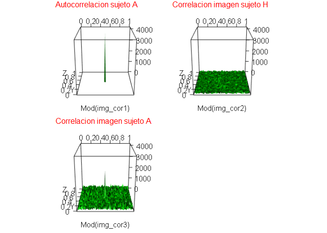

```r
library(EBImage)
library(readbitmap)
library(fftwtools)
library(rgl)
library(ggplot2)
source("fftshift.R") # centra el espectro de frecuencias
source("PCE.R") # Calcula PCE
source("PSR.R") # Calcula PSR
source("DC.R") # Calcula DC
```

# Resumen

Dentro de la denominación "reconocimiento de imágenes" se engloban todos aquellos métodos mediante los cuales es posible detectar la presencia de una determinada imagen, denominada imagen de referencia, dentro de otra imagen, que recibe el nombre de escena. En el caso en que dicha imagen de referencia se encuentre presente en la escena, algunos de estos métodos permiten además determinar su posición.

En este trabajo se pretende explorar el funcionamiento de filtros de correlación básicos, estos tienen la ventaja de determinar la posición de una imagen, además de reconocer un objeto.

A continuación se muestran los principios básicos de correlación, los filtros más conocidos y pruebas de desempeño a cada uno de ellos.

# Correlación

La correlación entre dos funciones se puede expresar como:

> $(f \otimes g)(r) = \int_{_{\Re^n}}f(r')g*(r'-r)dr'$


A partir de esta expresión se puede observar como la correlación se obtiene al desplazar la función $g*$ (conjugada de g ), multiplicar su valor en cada punto $r'$ por el valor de la función $f$ en dicho punto y realizar la suma para todos los puntos considerados. Los diferentes sumandos serán no nulos sólo si al desplazar la función $*$ g a un punto cualquiera $r_{0}$ existe una zona común entre ambas funciones. Si ambas funciones contienen información similar, se genera un máximo de correlación, a esto se denomina autocorrelación, en caso contrario, cuando las funciones no son iguales, se denomina correlación cruzada (el máximo de correlación cruzada es menor que el máximo de autocorrelación). En el caso de que tanto $f$ como $g$ representen imágenes, estas serán descritas únicamente mediante funciones bidimensionales $f(x,y)$ y $g(x,y)$.

En el proceso de reconocimiento por correlación no se utiliza directamente una imagen de referencia, sino que se extrae la información de ella y se crea un filtro que contiene dicha información, por lo que al realizar la correlación entre la imagen de referencia y el filtro se obtiene autocorrelación, en caso de ser otra imagen se obtiene correlación cruzada. Existen diversos tipos de filtros, cada uno de ellos optimiza un criterio de calidad.


## Criterios de calidad de correlación.

El diseño de filtros se realiza dependiendo del problema que se quiere resolver y del criterio que se desea optimizar. Para esto último existe un conjunto de criterios que establecen la calidad de la correlación en un aspecto determinado. Los más destacados a mencionar son los siguientes (*Calvo Padilla M (2002). "Óptica Avanzada". Editorial Ariel, España*):

**Relación señal a ruido (SNR):** Se define como el cuociente entre el valor esperado del máximo de correlación al cuadrado $E(c(0,0))$ y la varianza de este máximo $Var(c(0,0))$.

Si el ruido es aleatorio y estacionario la razón señal a ruido viene dada por la ecuación:

> $SNR = \frac{|E(c(0,0))|}{Var(c(0,0))} = \frac{|\iint H^*(u,v)I(u,v)dudv|}{\iint P_n(u,v)|H^*(u,v)|dudv}$

Donde $P_n(u,v)$ es la densidad espectral del ruido, $H(u,v)$ es el filtro e $I(u,v)$ es la imagen en el dominio de la frecuencia. El ruido presente en una escena puede variar el valor máximo de correlación según la cantidad de ruido. Este criterio mide la capacidad de detectar una escena de referencia frente a ruido en la escena.


**Energía concentrada en el máximo de correlación (PCE):** la energía de la escena se redistribuye en el plano de correlación. Al momento de filtrar lo que interesa es tener un máximo de correlación en el objeto a detectar que sea significativamente más alto que el entorno, por lo que este criterio es una medida de detectabilidad del máximo de correlación. Queda definido como el cuociente del máximo de energía y la energía del total del plano de correlación. Aplicando las propiedades de la transformada de Fourier se puede escribir como sigue:

> $PCE = \frac{|c(0,0)|^2}{\iint |c(x,y)|^2 dxdy} = \frac{|\iint H^*(u,v)I(u,v)dudv|^2}{\iint |H^(u,v)|^2 |I(u,v)|^2 dudv}$


**Capacidad de discriminación (DC):** establece la capacidad que tiene un filtro para distinguir entre dos objetos. Cuanto más cercana a uno es la DC, mejor es la discriminación del filtro, si la DC es cercana a cero, quiere decir que el filtro no distingue entre los dos objetos y los está reconociendo por igual. Sea $f(x,y)$ y $g(x,y)$ los objetos a detectar y rechazar por el filtro $h(x,y)$ respectivamente, con $c_{o}(x,y)$ y $c_{c}(x,y)$ como autocorrelación y correlación cruzada respecto del objeto a reconocer. La capacidad de discriminación queda como sigue:

> $DC = 1 - \frac{max(c_{c}(x,y)}{max(c_{o}(x,y)}$


**Razón de peak a lóbulo lateral (PSR):** mide la agudeza de un peak, mientras más
grande es el valor de la PSR mayor es la agudeza del peak. Sea $\mu_{0}$ el peak de correlación y, $\mu$ y $\sigma$ la media y la desviaciónvestándar de la región que rodea al peak, entonces:

> $PSR = \frac{\mu_{0} - \mu}{\sigma}$


# Diseño de filtros

Considerando los criterios de calidad se pueden diseñar diversos filtros que optimicen dichos criterios y puedan discriminar entre dos o más objetos.

## Filtro adaptado clásico (*Classic Matched Filter, CMF*).

Este filtro optimiza la razón señal a ruido y queda definido como:

> $H^*(u,v) = K \frac{I^*(u,v)}{P_n(u,v)}$

Si consideramos ruido blanco, el filtro queda de acuerdo a lo siguiente:

> $H^*(u,v) = I^*(u,v)$

## Filtro sólo fase (*Phase Only Filter, POF*).

Este filtro optimiza la eficiencia luminosa, ya que considera la fase. Su transmisión en amplitud es igual a uno.

> $H^*(u,v) = \frac{I^*(u,v)}{|I(u,v)|}$

## Filtro adaptado inverso

El filtro adaptado inverso optimiza la PCE.

> $H^*(u,v) = \frac{I^*(u,v)}{|I(u,v)|^2}$


# Pruebas

## Consideraciones

Para probar estos filtros vamos a considerar la base de datos de rostros de la página:

http://chenlab.ece.cornell.edu/projects/FaceAuthentication/Default.html

Esta base de datos considera 75 imagenes (64x64 pixeles) por individuo, con 13 individuos, como se muestra en la siguiente figura (individuo "A").


```r
img = Image(rotate(read.bitmap("dataExample.JPG"), angle  = 90))[,,1]
display(img, method = "raster")
```

<!-- -->

De estos datos probaremos los filtros para el primer individuo ("A"), discriminando de los demás, esto se realizará de la siguiente manera:

- Diseño de filtros con un rostro del individuo **A** (de forma aleatoria).
- Tomamos un rostro cualquiera de cualquier otro individuo como imagen para correlación cruzada considerado como impostor.
- Tomamos un rostro cualquiera del individuo **A**, distinta a la imagen de diseño del filtro, como imagen de prueba de auto correlación.
- Realizamos pruebas de PSR y DC para estos rostros.
- Se realizan 10000 pruebas con este formato.

Es necesario considerar que la capacidad de discriminación se tomará con referencia a la imagen de diseño del filtro, por lo que al realizar esta prueba con la imagen de prueba de correlación cruzada (individuo diferente) se esperan resultados cercanos a 1, lo que indica un buen funcionamiento del filtro para rechazar impostores. En contra posición, cuando se realiza la prueba con la imagen de prueba de auto correlación se esperan resultados cercanos a 0, lo que indica un buen funcionamiento del filtro para validar al sujeto con que se diseñó el filtro.

Los objetivos de estas pruebas son:

- Visualizar la capacidad de discrimincación de cada filtro.
- Evaluar si utilizando información de PSR y PCE es posible mejorar el rendimiento de cada filtro.

## Pruebas Filtro CMF


```r
dir1="./faceExpressionDatabase/"
Subject = LETTERS[1:13]
Number = c("00", "01", "02", "03", "04", "05", "06", "07", "08", "09", 
           "10", "11", "12", "13", "14", "15", "16", "17", "18", "19",
           "20", "21", "22", "23", "24", "25", "26", "27", "28", "29",
           "30", "31", "32", "33", "34", "35", "36", "37", "38", "39",
           "40", "41", "42", "43", "44", "45", "46", "47", "48", "49",
           "50", "51", "52", "53", "54", "55", "56", "57", "58", "59",
           "60", "61", "62", "63", "64", "65", "66", "67", "68", "69",
           "70", "71", "72", "73", "74")
n=10000 # numero de pruebas
set.seed(50)
TEST <- data.frame()
TESTpa <- data.frame()
for (k in 1:n) {
      # carga indices aleatorios
      SubjectP <- sample(Subject[2:13], 1)
      Ns <- sample(Number, 3, replace = FALSE)
      # lee imagenes de filtro y prueba
      img = Image(rotate(read.bitmap(paste0(dir1,Subject[1],Ns[1],".bmp"))/255/64/64,angle = 90))
      imgp = Image(rotate(read.bitmap(paste0(dir1,SubjectP,Ns[1],".bmp"))/255/64/64,angle = 90))
      img2 = Image(rotate(read.bitmap(paste0(dir1,Subject[1],Ns[3],".bmp"))/255/64/64,angle = 90))

      # calcula FFT a las imagenes
      fft1 <- fftshift(fftw2d(img))
      fft2 <- fftshift(fftw2d(imgp))
      fft3 <- fftshift(fftw2d(img2))

      # Filtros CMF
      H <- fftshift(fftw2d(img))
      H[is.na(H)] <- 0

      # Hace las correlaciones
      img_cor1 <- fftshift(fftw2d(fft1*Conj(H), inverse = TRUE))
      img_cor2 <- fftshift(fftw2d(fft2*Conj(H), inverse = TRUE))
      img_cor3 <- fftshift(fftw2d(fft3*Conj(H), inverse = TRUE))

      # Hace pruebas imagenes sin filtro PA
      TEST[2*k-1,1] <- PCE(img_cor1)
      TEST[2*k,1] <- PCE(img_cor1)
      TEST[2*k-1,2] <- PCE(img_cor2)
      TEST[2*k,2] <- PCE(img_cor3)
      
      TEST[2*k-1,3] <- PSR(Mod(img_cor1), Vec = 15)
      TEST[2*k,3] <- PSR(Mod(img_cor1), Vec = 15)
      TEST[2*k-1,4] <- PSR(Mod(img_cor2), Vec = 15)
      TEST[2*k,4] <- PSR(Mod(img_cor3), Vec = 15)
      
      TEST[2*k-1,5] <- DC(img_cor1, img_cor2, Co = c(32,32), Cc = c(32,32), Vec = 15)
      TEST[2*k,5] <- DC(img_cor1, img_cor3, Co = c(32,32), Cc = c(32,32), Vec = 15)
      
      TEST[2*k-1,6] <- "Im. prueba - no sujeto A"
      TEST[2*k,6] <- "Im. prueba - sujeto A"

      TEST[2*k-1,7] <- paste0(Subject[1],Ns[1],"-",Subject[1],Ns[3],"vs",SubjectP,Ns[2])
      TEST[2*k,7] <- paste0(Subject[1],Ns[1],"-",Subject[1],Ns[3],"vs",SubjectP,Ns[2])
}
colnames(TEST) <- c("PCEH", "PCE", "PSRH", "PSR", "DC", "imagen", "sample")
```

Al observar la curva de densidad de capacidad de discriminación (DC) nos damos cuenta que  el filtro tiene una buena capacidad de discriminación para reconocer al mismo individuo, pero tiene problemas rechazando a impostores.


```r
ggplot(data=TEST, aes(DC,fill=imagen)) +  geom_density(alpha=0.7)
```

<!-- -->

Ahora, al parecer el problema anterior se podría solucionar aplicando algún algoritmo de clasificación considerando las variables PCE y PSR y así aportar al filtro la capacidad de rechazar impostores, tal como se observa en los gráficos siguientes:


```r
ggplot(data=TEST, aes(PCE,fill=imagen)) +  geom_density(alpha=0.7)
```

<!-- -->

```r
ggplot(data=TEST, aes(PSR,fill=imagen)) +  geom_density(alpha=0.7)
```

<!-- -->

```r
ggplot(TEST, aes(PCE, PSR, color = imagen)) +
      geom_point(size = 2, alpha = 0.15)
```

<!-- -->


Una de las grandes ventajas de estos filtros es la capacidad de ubicar en el espacio al objeto reconocido. Si observamos tanto la imagenes como el gráfico en 3D nos damos cuenta que el peak central (con el que se detecta la ubicación) es muy pequeño, lo que dificulta esto.

Por otro lado, sin considerar el peak pequeño, el resto de resultado de correlación es muy similar, lo que explica la baja capacidad de rechazar impostores.


```r
set.seed(200)
SubjectP <- sample(Subject[2:13], 1)
Ns <- sample(Number, 3, replace = FALSE)
# lee imagenes de filtro y prueba
img = Image(rotate(read.bitmap(paste0(dir1,Subject[1],Ns[1],".bmp"))/255/64/64,
                   angle = 90))
imgp = Image(rotate(read.bitmap(paste0(dir1,SubjectP,Ns[1],".bmp"))/255/64/64,
                    angle = 90))
img2 = Image(rotate(read.bitmap(paste0(dir1,Subject[1],Ns[3],".bmp"))/255/64/64,
                    angle = 90))
# calcula FFT a las imagenes
fft1 <- fftshift(fftw2d(img))
fft2 <- fftshift(fftw2d(imgp))
fft3 <- fftshift(fftw2d(img2))
# Filtros CMF
H_cmf <- fftshift(fftw2d(img))
H_cmf[is.na(H_cmf)] <- 0
# Hace las correlaciones
img_cor1 <- fftshift(fftw2d(fft1*Conj(H_cmf), inverse = TRUE))
img_cor2 <- fftshift(fftw2d(fft2*Conj(H_cmf), inverse = TRUE))
img_cor3 <- fftshift(fftw2d(fft3*Conj(H_cmf), inverse = TRUE))

maxcor <- max(Mod(img_cor1))
display(combine(img*64*64, imgp*64*64, img2*64*64,
                Mod(img_cor1)/maxcor,
                Mod(img_cor2)/maxcor,
                Mod(img_cor2)/maxcor),
        all=TRUE, method = "raster")
text(x = 2, y = 2, label = paste("Imagen diseño filtro - sujeto", Subject[1]), adj = c(0,1),
     col = "red", cex = 1)
text(x = 64 + 2, y = 2, label = paste("Imagen prueba - sujeto", SubjectP), adj = c(0,1),
     col = "red", cex = 1)
text(x = 128 + 2, y = 2, label = paste("Imagen prueba - sujeto", Subject[1]), adj = c(0,1),
     col = "red", cex = 1)

text(x = 2, y = 64 + 2, label = paste("Autocorrelacion sujeto", Subject[1]), adj = c(0,1),
     col = "red", cex = 1)
text(x = 64 + 2, y = 64 + 2, label = paste("Correlacion imagen sujeto", SubjectP), adj = c(0,1),
     col = "red", cex = 1)
text(x = 128 + 2, y = 64 +  2, label = paste("Correlacion imagen sujeto", Subject[1]), adj = c(0,1),
     col = "red", cex = 1)
```

<!-- -->

```r
# carga imagenes de correlaciones (se ejecuta al final)
cor1 <- readImage("Autocorrelacion_cmf.png")
cor2 <- readImage("Correlacion Cruzada 1_cmf.png")
cor3 <- readImage("Correlacion Cruzada 2_cmf.png")
display(combine(cor1, cor2, cor3),
        all=TRUE, method = "raster")
text(x = 20, y =  2, label = paste("Autocorrelacion sujeto", Subject[1]), adj = c(0,1),
     col = "red", cex = 1)
text(x = 256 + 20, y = 2, label = paste("Correlacion imagen sujeto", SubjectP), adj = c(0,1),
     col = "red", cex = 1)
text(x = 20, y = 256 + 2, label = paste("Correlacion imagen sujeto", Subject[1]), adj = c(0,1),
     col = "red", cex = 1)
```

<!-- -->

```r
# open3d()
# persp3d(Mod(img_cor1), col = "green", zlim = c(0,maxcor))
# rgl.snapshot("Autocorrelacion_cmf.png")
# # rglwidget()
# rgl.close()
# open3d()
# persp3d(Mod(img_cor2), col = "green", zlim = c(0,maxcor))
# rgl.snapshot("Correlacion Cruzada 1_cmf.png")
# # rglwidget()
# rgl.close()
# open3d()
# persp3d(Mod(img_cor3), col = "green", zlim = c(0,maxcor))
# rgl.snapshot("Correlacion Cruzada 2_cmf.png")
# # rglwidget()
# rgl.close()
```

Ahora, como se observa en las imagenes siguientes, el filtro CMF tiene una capacidad media de ubicación de los elementos, pero al no tener buena capacidad de discriminació reconoce a ambos sujetos como validos.


```r
set.seed(200)
SubjectP <- sample(Subject[2:13], 1)
Ns <- sample(Number, 3, replace = FALSE)
# lee imagenes de filtro y prueba
img = Image(rotate(read.bitmap(paste0(dir1,Subject[1],Ns[1],".bmp"))/255/64/64,
                   angle = 90))
imgp = Image(rotate(read.bitmap(paste0(dir1,SubjectP,Ns[1],".bmp"))/255/64/64,
                    angle = 90))
img2 = Image(rotate(read.bitmap(paste0(dir1,Subject[1],Ns[3],".bmp"))/255/64/64,
                    angle = 90))
img_b <- as.array(resize(img*0, w=256, h=256))
img_ref <- img_b
# agrega imagenes de prueba pequeñas a otra grande
for (i in 1:64) {
      for (j in 1:64) {
            img_b[35+i,35+j] <- as.matrix(imageData(imgp)[i,j])
            img_b[150+i,130+j] <- as.matrix(imageData(img2)[i,j])
      }
}

# agrega imagen de fitro pequeñ a otra grande
for (i in 1:64) {
      for (j in 1:64) {
            img_ref[96+i,96+j] <- as.matrix(imageData(img)[i,j])
      }
}
# calcula FFT a las imagenes
fft1 <- fftshift(fftw2d(img_ref))
fft2 <- fftshift(fftw2d(img_b))
# Filtros CMF
H_cmf <- fftshift(fftw2d(img_ref))
H_cmf[is.na(H_cmf)] <- 0
# Hace las correlaciones
img_cor1 <- fftshift(fftw2d(fft1*Conj(H_cmf), inverse = TRUE))
img_cor2 <- fftshift(fftw2d(fft2*Conj(H_cmf), inverse = TRUE))

maxcor <- max(Mod(img_cor1))
display(combine(Image(img_ref*64*64),Image(img_b*64*64),
                Mod(img_cor1)/max(Mod(img_cor1)),
                Mod(img_cor2)/max(Mod(img_cor2))),
        all=TRUE, method = "raster")

text(x = 2, y = 2, label = "Imagen diseño filtro", adj = c(0,1),
     col = "red", cex = 1)
text(x = 256 + 2, y = 2, label ="Imagen prueba", adj = c(0,1),
     col = "red", cex = 1)

text(x = 2, y = 256 + 2, label = paste("Autocorrelacion sujeto", Subject[1]), adj = c(0,1),
     col = "red", cex = 1)
text(x = 256 + 2, y = 256 + 2, label = "Correlacion imagen de prueba", adj = c(0,1),
     col = "red", cex = 1)
```

<!-- -->

```r
# carga imagenes de correlaciones (se ejecuta al final)
cor1 <- readImage("Autocorrelacion_ub_cmf.png")
cor2 <- readImage("Correlacion Cruzada 1_ub_cmf.png")
display(combine(cor1, cor2),
        all=TRUE, method = "raster")
text(x = 70, y =  2, label = paste("Autocorrelacion sujeto", Subject[1]), adj = c(0,1),
     col = "red", cex = 1)
text(x = 256 + 50, y = 2, label = "Correlacion imagen de prueba", adj = c(0,1),
     col = "red", cex = 1)
```

<!-- -->

```r
# open3d()
# persp3d(Mod(img_cor1), col = "green", zlim = c(0,maxcor))
# rgl.snapshot("Autocorrelacion_ub_cmf.png")
# # rglwidget()
# rgl.close()
# open3d()
# persp3d(Mod(img_cor2), col = "green", zlim = c(0,maxcor))
# rgl.snapshot("Correlacion Cruzada 1_ub_cmf.png")
# # rglwidget()
# rgl.close()
```

## Pruebas Filtro POF


```r
dir1="./faceExpressionDatabase/"
Subject = LETTERS[1:13]
Number = c("00", "01", "02", "03", "04", "05", "06", "07", "08", "09", 
           "10", "11", "12", "13", "14", "15", "16", "17", "18", "19",
           "20", "21", "22", "23", "24", "25", "26", "27", "28", "29",
           "30", "31", "32", "33", "34", "35", "36", "37", "38", "39",
           "40", "41", "42", "43", "44", "45", "46", "47", "48", "49",
           "50", "51", "52", "53", "54", "55", "56", "57", "58", "59",
           "60", "61", "62", "63", "64", "65", "66", "67", "68", "69",
           "70", "71", "72", "73", "74")
n=10000 # numero de pruebas
set.seed(50)
TEST <- data.frame()
TESTpa <- data.frame()
for (k in 1:n) {
      # carga indices aleatorios
      SubjectP <- sample(Subject[2:13], 1)
      Ns <- sample(Number, 3, replace = FALSE)
      # lee imagenes de filtro y prueba
      img = Image(rotate(read.bitmap(paste0(dir1,Subject[1],Ns[1],".bmp"))/255/64/64,angle = 90))
      imgp = Image(rotate(read.bitmap(paste0(dir1,SubjectP,Ns[1],".bmp"))/255/64/64,angle = 90))
      img2 = Image(rotate(read.bitmap(paste0(dir1,Subject[1],Ns[3],".bmp"))/255/64/64,angle = 90))

      # calcula FFT a las imagenes
      fft1 <- fftshift(fftw2d(img))
      fft2 <- fftshift(fftw2d(imgp))
      fft3 <- fftshift(fftw2d(img2))

      # Filtros POF
      H <- fftshift(fftw2d(img))/Mod(fftshift(fftw2d(img)))
      H[is.na(H)] <- 0

      # Hace las correlaciones
      img_cor1 <- fftshift(fftw2d(fft1*Conj(H), inverse = TRUE))
      img_cor2 <- fftshift(fftw2d(fft2*Conj(H), inverse = TRUE))
      img_cor3 <- fftshift(fftw2d(fft3*Conj(H), inverse = TRUE))

      # Hace pruebas imagenes sin filtro PA
      TEST[2*k-1,1] <- PCE(img_cor1)
      TEST[2*k,1] <- PCE(img_cor1)
      TEST[2*k-1,2] <- PCE(img_cor2)
      TEST[2*k,2] <- PCE(img_cor3)
      
      TEST[2*k-1,3] <- PSR(Mod(img_cor1), Vec = 15)
      TEST[2*k,3] <- PSR(Mod(img_cor1), Vec = 15)
      TEST[2*k-1,4] <- PSR(Mod(img_cor2), Vec = 15)
      TEST[2*k,4] <- PSR(Mod(img_cor3), Vec = 15)
      
      TEST[2*k-1,5] <- DC(img_cor1, img_cor2, Co = c(32,32), Cc = c(32,32), Vec = 15)
      TEST[2*k,5] <- DC(img_cor1, img_cor3, Co = c(32,32), Cc = c(32,32), Vec = 15)
      
      TEST[2*k-1,6] <- "Im. prueba - no sujeto A"
      TEST[2*k,6] <- "Im. prueba - sujeto A"

      TEST[2*k-1,7] <- paste0(Subject[1],Ns[1],"-",Subject[1],Ns[3],"vs",SubjectP,Ns[2])
      TEST[2*k,7] <- paste0(Subject[1],Ns[1],"-",Subject[1],Ns[3],"vs",SubjectP,Ns[2])
}
colnames(TEST) <- c("PCEH", "PCE", "PSRH", "PSR", "DC", "imagen", "sample")
```

Para este filtro hay una clara separación de las regiones de aceptación y rechazo. Y aunque la capacidad de aceptar un individuo de la misma clase no es tan cercana a 0, se pueden identificar claramente umbrales que permitirían diferenciar entre las imagenes a rechazar y aceptar.


```r
ggplot(data=TEST, aes(DC,fill=imagen)) +  geom_density(alpha=0.7)
```

<!-- -->

Ahora, se aprecia lo mismo (una clara separación entre los objetivos a rechazar y aceptar) que con la capacidad de discriminación, por lo que aplicando la idea anterior para el PCE y PSR se podría mejorar la robustez del filtro.


```r
ggplot(data=TEST, aes(PCE,fill=imagen)) +  geom_density(alpha=0.7)
```

<!-- -->

```r
ggplot(data=TEST, aes(PSR,fill=imagen)) +  geom_density(alpha=0.7)
```

<!-- -->

```r
ggplot(TEST, aes(PCE, PSR, color = imagen)) +
      geom_point(size = 2, alpha = 0.15)
```

<!-- -->

En este caso los peak asociados al sujeto "A" son altos y delgados,lo que facilita la ubicación de la imagen al ser detectada. El peak asociado al impostor es casi nulo, lo que ayuda a rechazar a este individuo.


```r
set.seed(200)
SubjectP <- sample(Subject[2:13], 1)
Ns <- sample(Number, 3, replace = FALSE)
# lee imagenes de filtro y prueba
img = Image(rotate(read.bitmap(paste0(dir1,Subject[1],Ns[1],".bmp"))/255/64/64,
                   angle = 90))
imgp = Image(rotate(read.bitmap(paste0(dir1,SubjectP,Ns[1],".bmp"))/255/64/64,
                    angle = 90))
img2 = Image(rotate(read.bitmap(paste0(dir1,Subject[1],Ns[3],".bmp"))/255/64/64,
                    angle = 90))
# calcula FFT a las imagenes
fft1 <- fftshift(fftw2d(img))
fft2 <- fftshift(fftw2d(imgp))
fft3 <- fftshift(fftw2d(img2))
# Filtros POF
H_pof <- fftshift(fftw2d(img))/Mod(fftshift(fftw2d(img)))
H_pof[is.na(H_pof)] <- 0
# Hace las correlaciones
img_cor1 <- fftshift(fftw2d(fft1*Conj(H_pof), inverse = TRUE))
img_cor2 <- fftshift(fftw2d(fft2*Conj(H_pof), inverse = TRUE))
img_cor3 <- fftshift(fftw2d(fft3*Conj(H_pof), inverse = TRUE))

maxcor <- max(Mod(img_cor1))
display(combine(img*64*64, imgp*64*64, img2*64*64,
                Mod(img_cor1)/maxcor,
                Mod(img_cor2)/maxcor,
                Mod(img_cor2)/maxcor),
        all=TRUE, method = "raster")
text(x = 2, y = 2, label = paste("Imagen diseño filtro - sujeto", Subject[1]), adj = c(0,1),
     col = "red", cex = 1)
text(x = 64 + 2, y = 2, label = paste("Imagen prueba - sujeto", SubjectP), adj = c(0,1),
     col = "red", cex = 1)
text(x = 128 + 2, y = 2, label = paste("Imagen prueba - sujeto", Subject[1]), adj = c(0,1),
     col = "red", cex = 1)

text(x = 2, y = 64 + 2, label = paste("Autocorrelacion sujeto", Subject[1]), adj = c(0,1),
     col = "red", cex = 1)
text(x = 64 + 2, y = 64 + 2, label = paste("Correlacion imagen sujeto", SubjectP), adj = c(0,1),
     col = "red", cex = 1)
text(x = 128 + 2, y = 64 +  2, label = paste("Correlacion imagen sujeto", Subject[1]), adj = c(0,1),
     col = "red", cex = 1)
```

<!-- -->

```r
# carga imagenes de correlaciones (se ejecuta al final)
cor1 <- readImage("Autocorrelacion_pof.png")
cor2 <- readImage("Correlacion Cruzada 1_pof.png")
cor3 <- readImage("Correlacion Cruzada 2_pof.png")
display(combine(cor1, cor2, cor3),
        all=TRUE, method = "raster")
text(x = 20, y =  2, label = paste("Autocorrelacion sujeto", Subject[1]), adj = c(0,1),
     col = "red", cex = 1)
text(x = 256 + 20, y = 2, label = paste("Correlacion imagen sujeto", SubjectP), adj = c(0,1),
     col = "red", cex = 1)
text(x = 20, y = 256 + 2, label = paste("Correlacion imagen sujeto", Subject[1]), adj = c(0,1),
     col = "red", cex = 1)
```

<!-- -->

```r
# open3d()
# persp3d(Mod(img_cor1), col = "green", zlim = c(0,maxcor))
# rgl.snapshot("Autocorrelacion_pof.png")
# # rglwidget()
# rgl.close()
# open3d()
# persp3d(Mod(img_cor2), col = "green", zlim = c(0,maxcor))
# rgl.snapshot("Correlacion Cruzada 1_pof.png")
# # rglwidget()
# rgl.close()
# open3d()
# persp3d(Mod(img_cor3), col = "green", zlim = c(0,maxcor))
# rgl.snapshot("Correlacion Cruzada 2_pof.png")
# # rglwidget()
# rgl.close()
```

Revisando la capacidad para ubicar objetos, el filtro POF muestra mejor desempeño que el filtro CMF, aunque disminuye su rendimiento comparado con las escenas centradas. De todas maneras es posible realizar una discriminación y con ayuda de algún algoritmo de clasificación es posible mejorar este inconveniente.


```r
set.seed(200)
SubjectP <- sample(Subject[2:13], 1)
Ns <- sample(Number, 3, replace = FALSE)
# lee imagenes de filtro y prueba
img = Image(rotate(read.bitmap(paste0(dir1,Subject[1],Ns[1],".bmp"))/255/64/64,
                   angle = 90))
imgp = Image(rotate(read.bitmap(paste0(dir1,SubjectP,Ns[1],".bmp"))/255/64/64,
                    angle = 90))
img2 = Image(rotate(read.bitmap(paste0(dir1,Subject[1],Ns[3],".bmp"))/255/64/64,
                    angle = 90))
img_b <- as.array(resize(img*0, w=256, h=256))
img_ref <- img_b
# agrega imagenes de prueba pequeñas a otra grande
for (i in 1:64) {
      for (j in 1:64) {
            img_b[35+i,35+j] <- as.matrix(imageData(imgp)[i,j])
            img_b[150+i,130+j] <- as.matrix(imageData(img2)[i,j])
      }
}

# agrega imagen de fitro pequeñ a otra grande
for (i in 1:64) {
      for (j in 1:64) {
            img_ref[96+i,96+j] <- as.matrix(imageData(img)[i,j])
      }
}
# calcula FFT a las imagenes
fft1 <- fftshift(fftw2d(img_ref))
fft2 <- fftshift(fftw2d(img_b))
# Filtros POF
H_pof <- fftshift(fftw2d(img_ref))/Mod(fftshift(fftw2d(img_ref)))
H_pof[is.na(H_pof)] <- 0
# Hace las correlaciones
img_cor1 <- fftshift(fftw2d(fft1*Conj(H_pof), inverse = TRUE))
img_cor2 <- fftshift(fftw2d(fft2*Conj(H_pof), inverse = TRUE))

maxcor <- max(Mod(img_cor1))
display(combine(Image(img_ref*64*64),Image(img_b*64*64),
                Mod(img_cor1)/max(Mod(img_cor1)),
                Mod(img_cor2)/max(Mod(img_cor2))),
        all=TRUE, method = "raster")

text(x = 2, y = 2, label = "Imagen diseño filtro", adj = c(0,1),
     col = "red", cex = 1)
text(x = 256 + 2, y = 2, label ="Imagen prueba", adj = c(0,1),
     col = "red", cex = 1)

text(x = 2, y = 256 + 2, label = paste("Autocorrelacion sujeto", Subject[1]), adj = c(0,1),
     col = "red", cex = 1)
text(x = 256 + 2, y = 256 + 2, label = "Correlacion imagen de prueba", adj = c(0,1),
     col = "red", cex = 1)
```

<!-- -->

```r
# carga imagenes de correlaciones (se ejecuta al final)
cor1 <- readImage("Autocorrelacion_ub_pof.png")
cor2 <- readImage("Correlacion Cruzada 1_ub_pof.png")
display(combine(cor1, cor2),
        all=TRUE, method = "raster")
text(x = 70, y =  2, label = paste("Autocorrelacion sujeto", Subject[1]), adj = c(0,1),
     col = "red", cex = 1)
text(x = 256 + 50, y = 2, label = "Correlacion imagen de prueba", adj = c(0,1),
     col = "red", cex = 1)
```

<!-- -->

```r
# open3d()
# persp3d(Mod(img_cor1), col = "green", zlim = c(0,maxcor))
# rgl.snapshot("Autocorrelacion_ub_pof.png")
# # rglwidget()
# rgl.close()
# open3d()
# persp3d(Mod(img_cor2), col = "green", zlim = c(0,maxcor))
# rgl.snapshot("Correlacion Cruzada 1_ub_pof.png")
# # rglwidget()
# rgl.close()
```
## Pruebas Filtro Inverso


```r
dir1="./faceExpressionDatabase/"
Subject = LETTERS[1:13]
Number = c("00", "01", "02", "03", "04", "05", "06", "07", "08", "09", 
           "10", "11", "12", "13", "14", "15", "16", "17", "18", "19",
           "20", "21", "22", "23", "24", "25", "26", "27", "28", "29",
           "30", "31", "32", "33", "34", "35", "36", "37", "38", "39",
           "40", "41", "42", "43", "44", "45", "46", "47", "48", "49",
           "50", "51", "52", "53", "54", "55", "56", "57", "58", "59",
           "60", "61", "62", "63", "64", "65", "66", "67", "68", "69",
           "70", "71", "72", "73", "74")
n=10000 # numero de pruebas
set.seed(50)
TEST <- data.frame()
TESTpa <- data.frame()
for (k in 1:n) {
      # carga indices aleatorios
      SubjectP <- sample(Subject[2:13], 1)
      Ns <- sample(Number, 3, replace = FALSE)
      # lee imagenes de filtro y prueba
      img = Image(rotate(read.bitmap(paste0(dir1,Subject[1],Ns[1],".bmp"))/255/64/64,angle = 90))
      imgp = Image(rotate(read.bitmap(paste0(dir1,SubjectP,Ns[1],".bmp"))/255/64/64,angle = 90))
      img2 = Image(rotate(read.bitmap(paste0(dir1,Subject[1],Ns[3],".bmp"))/255/64/64,angle = 90))

      # calcula FFT a las imagenes
      fft1 <- fftshift(fftw2d(img))
      fft2 <- fftshift(fftw2d(imgp))
      fft3 <- fftshift(fftw2d(img2))

      # Filtros Inverso
      H <- fftshift(fftw2d(img))/Mod(fftshift(fftw2d(img))^2)
      H[is.na(H)] <- 0

      # Hace las correlaciones
      img_cor1 <- fftshift(fftw2d(fft1*Conj(H), inverse = TRUE))
      img_cor2 <- fftshift(fftw2d(fft2*Conj(H), inverse = TRUE))
      img_cor3 <- fftshift(fftw2d(fft3*Conj(H), inverse = TRUE))

      # Hace pruebas imagenes sin filtro PA
      TEST[2*k-1,1] <- PCE(img_cor1)
      TEST[2*k,1] <- PCE(img_cor1)
      TEST[2*k-1,2] <- PCE(img_cor2)
      TEST[2*k,2] <- PCE(img_cor3)
      
      TEST[2*k-1,3] <- PSR(Mod(img_cor1), Vec = 15)
      TEST[2*k,3] <- PSR(Mod(img_cor1), Vec = 15)
      TEST[2*k-1,4] <- PSR(Mod(img_cor2), Vec = 15)
      TEST[2*k,4] <- PSR(Mod(img_cor3), Vec = 15)
      
      TEST[2*k-1,5] <- DC(img_cor1, img_cor2, Co = c(32,32), Cc = c(32,32), Vec = 15)
      TEST[2*k,5] <- DC(img_cor1, img_cor3, Co = c(32,32), Cc = c(32,32), Vec = 15)
      
      TEST[2*k-1,6] <- "Im. prueba - no sujeto A"
      TEST[2*k,6] <- "Im. prueba - sujeto A"

      TEST[2*k-1,7] <- paste0(Subject[1],Ns[1],"-",Subject[1],Ns[3],"vs",SubjectP,Ns[2])
      TEST[2*k,7] <- paste0(Subject[1],Ns[1],"-",Subject[1],Ns[3],"vs",SubjectP,Ns[2])
}
colnames(TEST) <- c("PCEH", "PCE", "PSRH", "PSR", "DC", "imagen", "sample")
```

Este filtro tiene la mejor capacidad para rechazar a impostores, aunque en algunos casos podría rechazar al mismo individuo. Esto podría ser un problema a la hora de aplicarlo.


```r
ggplot(data=TEST, aes(DC,fill=imagen)) +  geom_density(alpha=0.7)
```

<!-- -->

Además, observando los datos, para diferenciar a al sujeto "A" de in impostor en este caso es mejor utilizar una relación entre la DC y el PSR.

Para mejorar la visualización se multiplica PSR por DC^2, donde se observa una separación parcial de las regiones, aunque suficiente para implementar algún algoritmo de clasificación a apoye el desempeño del filtro.


```r
ggplot(data=TEST, aes(log(PCE),fill=imagen)) +  geom_density(alpha=0.7)
```

<!-- -->

```r
ggplot(data=TEST, aes(PSR,fill=imagen)) +  geom_density(alpha=0.7)
```

<!-- -->

```r
ggplot(TEST, aes(DC, log(PCE)*PSR*DC, color = imagen)) +
      geom_point(size = 2, alpha = 0.15)
```

<!-- -->

Este caso es similar al filtro POF, los peak asociados al sujeto "A" son altos y delgados,lo que facilita la ubicación de la imagen al ser detectada. El peak asociado al impostor es casi nulo, lo que ayuda a rechazar a este individuo.


```r
set.seed(200)
SubjectP <- sample(Subject[2:13], 1)
Ns <- sample(Number, 3, replace = FALSE)
# lee imagenes de filtro y prueba
img = Image(rotate(read.bitmap(paste0(dir1,Subject[1],Ns[1],".bmp"))/255/64/64,
                   angle = 90))
imgp = Image(rotate(read.bitmap(paste0(dir1,SubjectP,Ns[1],".bmp"))/255/64/64,
                    angle = 90))
img2 = Image(rotate(read.bitmap(paste0(dir1,Subject[1],Ns[3],".bmp"))/255/64/64,
                    angle = 90))
# calcula FFT a las imagenes
fft1 <- fftshift(fftw2d(img))
fft2 <- fftshift(fftw2d(imgp))
fft3 <- fftshift(fftw2d(img2))
# Filtros Inverso
H_inv <- fftshift(fftw2d(img))/Mod(fftshift(fftw2d(img))^2)
H_inv[is.na(H_inv)] <- 0
# Hace las correlaciones
img_cor1 <- fftshift(fftw2d(fft1*Conj(H_inv), inverse = TRUE))
img_cor2 <- fftshift(fftw2d(fft2*Conj(H_inv), inverse = TRUE))
img_cor3 <- fftshift(fftw2d(fft3*Conj(H_inv), inverse = TRUE))

maxcor <- max(Mod(img_cor1))
display(combine(img*64*64, imgp*64*64, img2*64*64,
                Mod(img_cor1)/maxcor,
                Mod(img_cor2)/maxcor,
                Mod(img_cor2)/maxcor),
        all=TRUE, method = "raster")
text(x = 2, y = 2, label = paste("Imagen diseño filtro - sujeto", Subject[1]), adj = c(0,1),
     col = "red", cex = 1)
text(x = 64 + 2, y = 2, label = paste("Imagen prueba - sujeto", SubjectP), adj = c(0,1),
     col = "red", cex = 1)
text(x = 128 + 2, y = 2, label = paste("Imagen prueba - sujeto", Subject[1]), adj = c(0,1),
     col = "red", cex = 1)

text(x = 2, y = 64 + 2, label = paste("Autocorrelacion sujeto", Subject[1]), adj = c(0,1),
     col = "red", cex = 1)
text(x = 64 + 2, y = 64 + 2, label = paste("Correlacion imagen sujeto", SubjectP), adj = c(0,1),
     col = "red", cex = 1)
text(x = 128 + 2, y = 64 +  2, label = paste("Correlacion imagen sujeto", Subject[1]), adj = c(0,1),
     col = "red", cex = 1)
```

<!-- -->

```r
# carga imagenes de correlaciones (se ejecuta al final)
cor1 <- readImage("Autocorrelacion_inv.png")
cor2 <- readImage("Correlacion Cruzada 1_inv.png")
cor3 <- readImage("Correlacion Cruzada 2_inv.png")
display(combine(cor1, cor2, cor3),
        all=TRUE, method = "raster")
text(x = 20, y =  2, label = paste("Autocorrelacion sujeto", Subject[1]), adj = c(0,1),
     col = "red", cex = 1)
text(x = 256 + 20, y = 2, label = paste("Correlacion imagen sujeto", SubjectP), adj = c(0,1),
     col = "red", cex = 1)
text(x = 20, y = 256 + 2, label = paste("Correlacion imagen sujeto", Subject[1]), adj = c(0,1),
     col = "red", cex = 1)
```

<!-- -->

```r
# open3d()
# persp3d(Mod(img_cor1), col = "green", zlim = c(0,maxcor))
# rgl.snapshot("Autocorrelacion_inv.png")
# # rglwidget()
# rgl.close()
# open3d()
# persp3d(Mod(img_cor2), col = "green", zlim = c(0,maxcor))
# rgl.snapshot("Correlacion Cruzada 1_inv.png")
# # rglwidget()
# rgl.close()
# open3d()
# persp3d(Mod(img_cor3), col = "green", zlim = c(0,maxcor))
# rgl.snapshot("Correlacion Cruzada 2_inv.png")
# # rglwidget()
# rgl.close()
```

La capacidad para ubicar objetos muestra un muy buen desempeño, incluso mayor al filtro POF.


```r
set.seed(200)
SubjectP <- sample(Subject[2:13], 1)
Ns <- sample(Number, 3, replace = FALSE)
# lee imagenes de filtro y prueba
img = Image(rotate(read.bitmap(paste0(dir1,Subject[1],Ns[1],".bmp"))/255/64/64,
                   angle = 90))
imgp = Image(rotate(read.bitmap(paste0(dir1,SubjectP,Ns[1],".bmp"))/255/64/64,
                    angle = 90))
img2 = Image(rotate(read.bitmap(paste0(dir1,Subject[1],Ns[3],".bmp"))/255/64/64,
                    angle = 90))
img_b <- as.array(resize(img*0, w=256, h=256))
img_ref <- img_b
# agrega imagenes de prueba pequeñas a otra grande
for (i in 1:64) {
      for (j in 1:64) {
            img_b[35+i,35+j] <- as.matrix(imageData(imgp)[i,j])
            img_b[150+i,130+j] <- as.matrix(imageData(img2)[i,j])
      }
}

# agrega imagen de fitro pequeñ a otra grande
for (i in 1:64) {
      for (j in 1:64) {
            img_ref[96+i,96+j] <- as.matrix(imageData(img)[i,j])
      }
}
# calcula FFT a las imagenes
fft1 <- fftshift(fftw2d(img_ref))
fft2 <- fftshift(fftw2d(img_b))
# Filtros Inverso
H_inv <- fftshift(fftw2d(img_ref))/Mod(fftshift(fftw2d(img_ref))^2)
H_inv[is.na(H_inv)] <- 0
# Hace las correlaciones
img_cor1 <- fftshift(fftw2d(fft1*Conj(H_inv), inverse = TRUE))
img_cor2 <- fftshift(fftw2d(fft2*Conj(H_inv), inverse = TRUE))

maxcor <- max(Mod(img_cor1))
display(combine(Image(img_ref*64*64),Image(img_b*64*64),
                Mod(img_cor1)*5/max(Mod(img_cor1)),
                Mod(img_cor2)*5/max(Mod(img_cor2))),
        all=TRUE, method = "raster")

text(x = 2, y = 2, label = "Imagen diseño filtro", adj = c(0,1),
     col = "red", cex = 1)
text(x = 256 + 2, y = 2, label ="Imagen prueba", adj = c(0,1),
     col = "red", cex = 1)

text(x = 2, y = 256 + 2, label = paste("Autocorrelacion sujeto", Subject[1]), adj = c(0,1),
     col = "red", cex = 1)
text(x = 256 + 2, y = 256 + 2, label = "Correlacion imagen de prueba", adj = c(0,1),
     col = "red", cex = 1)
```

<!-- -->

```r
# carga imagenes de correlaciones (se ejecuta al final)
cor1 <- readImage("Autocorrelacion_ub_inv.png")
cor2 <- readImage("Correlacion Cruzada 1_ub_inv.png")
display(combine(cor1, cor2),
        all=TRUE, method = "raster")
text(x = 70, y =  2, label = paste("Autocorrelacion sujeto", Subject[1]), adj = c(0,1),
     col = "red", cex = 1)
text(x = 256 + 50, y = 2, label = "Correlacion imagen de prueba", adj = c(0,1),
     col = "red", cex = 1)
```

<!-- -->

```r
# open3d()
# persp3d(Mod(img_cor1), col = "green", zlim = c(0,maxcor))
# rgl.snapshot("Autocorrelacion_ub_inv.png")
# # rglwidget()
# rgl.close()
# open3d()
# persp3d(Mod(img_cor2), col = "green", zlim = c(0,maxcor))
# rgl.snapshot("Correlacion Cruzada 1_ub_inv.png")
# # rglwidget()
# rgl.close()
```

---

# Conclusiones

Los cálculos realizados presentan diseño de filtros de correlación con solo una imagen y son capaces de discriminar entre la imagen de diseño y un impostor.

En el caso del filtro CMF, aunque la capacidad de discriminación no sea muy buena, se aprecia que es posible realizar un clasificador basado en el PCE y PSR que discrimine entre individuos aceptados e impostores. Otro punto es la capacidad de ubicación espacial, esta no es fina y puede ubicar en una zona bastante amplia y no en un punto en específico.

Para el filtro POF sucede que presenta una buena capacidad de discriminación tanto aceptación como rechazo. Además se aprecia que se puede apoyar el desempeño de un filtro mediante un clasificador basado en PCE y PSR. Por otro lado presenta un buen desempeño en ubicación espacial, donde disminuye su capacidad de discriminación, pero no de manera extrema, esto se puede complementar con el clasificador para mejorar el desempeño.

El filtro con mejor desempeño de ubicación espaciales el filtro inverso, este discrimina de buena manera incluso desplazando las imagenes en la escena. Presenta además una mejor capacidad de rechazo, pero tiene un menor desempeño en capacidad de aceptación que el filtro TOF, esto se podría mejorar utilizando un clasificador en función de la DC, PCE y PSR.

---

# Referencia

Para revisar el código de este trabajo ir a:

https://github.com/desareca/Procesamiento-Imagenes-R

---

# Información de sesión


```r
sessionInfo()
```

```
R version 3.5.2 (2018-12-20)
Platform: x86_64-w64-mingw32/x64 (64-bit)
Running under: Windows 10 x64 (build 17134)

Matrix products: default

locale:
[1] LC_COLLATE=Spanish_Chile.1252  LC_CTYPE=Spanish_Chile.1252   
[3] LC_MONETARY=Spanish_Chile.1252 LC_NUMERIC=C                  
[5] LC_TIME=Spanish_Chile.1252    

attached base packages:
[1] stats     graphics  grDevices utils     datasets  methods   base     

other attached packages:
[1] ggplot2_3.1.0    rgl_0.99.16      fftwtools_0.9-8  readbitmap_0.1.5
[5] EBImage_4.24.0  

loaded via a namespace (and not attached):
 [1] tidyselect_0.2.5        locfit_1.5-9.1         
 [3] xfun_0.4                purrr_0.3.0            
 [5] lattice_0.20-38         colorspace_1.4-0       
 [7] miniUI_0.1.1.1          htmltools_0.3.6        
 [9] yaml_2.2.0              rlang_0.3.1            
[11] manipulateWidget_0.10.0 later_0.8.0            
[13] pillar_1.3.1            withr_2.1.2            
[15] glue_1.3.0              BiocGenerics_0.28.0    
[17] bindrcpp_0.2.2          jpeg_0.1-8             
[19] plyr_1.8.4              bindr_0.1.1            
[21] stringr_1.4.0           munsell_0.5.0          
[23] gtable_0.2.0            htmlwidgets_1.3        
[25] evaluate_0.13           knitr_1.21             
[27] httpuv_1.4.5.1          crosstalk_1.0.0        
[29] parallel_3.5.2          Rcpp_1.0.0             
[31] xtable_1.8-3            promises_1.0.1         
[33] scales_1.0.0            webshot_0.5.1          
[35] jsonlite_1.6            abind_1.4-5            
[37] mime_0.6                bmp_0.3                
[39] png_0.1-7               digest_0.6.18          
[41] stringi_1.2.4           tiff_0.1-5             
[43] dplyr_0.7.8             shiny_1.2.0            
[45] grid_3.5.2              tools_3.5.2            
[47] bitops_1.0-6            magrittr_1.5           
[49] RCurl_1.95-4.11         lazyeval_0.2.1         
[51] tibble_2.0.1            crayon_1.3.4           
[53] pkgconfig_2.0.2         assertthat_0.2.0       
[55] rmarkdown_1.11          R6_2.4.0               
[57] compiler_3.5.2         
```


